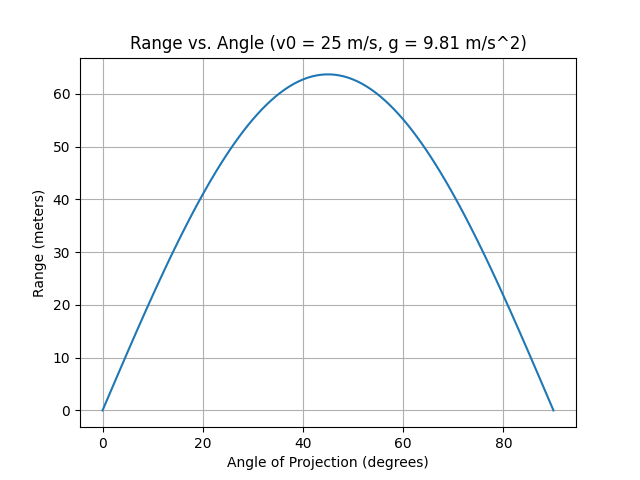
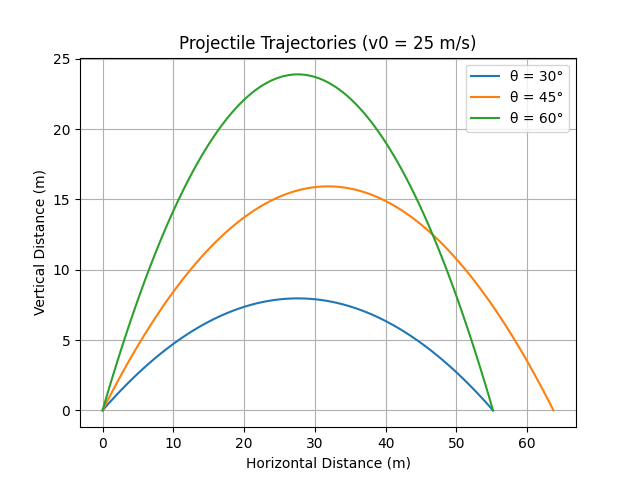
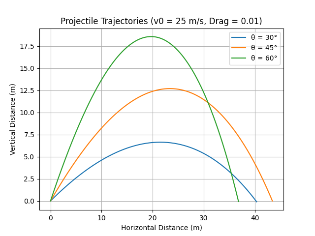

# Problem 1
# Projectile Motion: Range vs. Angle of Projection - Detailed Analysis
## **Introduction: A Journey into Trajectory**

Welcome to an exploration of projectile motion, a fundamental concept in physics that governs the flight of objects through the air. From the arc of a thrown ball to the trajectory of a rocket, understanding projectile motion allows us to predict and control the paths of countless objects. This presentation dives deep into the underlying principles, practical applications, and computational modeling of this fascinating phenomenon.


## **1. Theoretical Foundation: Unraveling the Motion**

### Derivation of Governing Equations: A Step-by-Step Approach

Let's delve deeper into the derivation. We begin with Newton's second law, $\vec{F} = m\vec{a}$. The only force acting on the projectile is gravity, $\vec{F} = m\vec{g}$, where $\vec{g} = (0, -g)$ and $g \approx 9.81 \, \text{m/s}^2$.

From this, we get the acceleration vector:

$$\vec{a} = \frac{\vec{F}}{m} = \vec{g} = (0, -g)$$

This leads to the following differential equations:

$$\frac{d^2x}{dt^2} = 0 
\\ 
\frac{d^2y}{dt^2} = -g$$

Integrating once with respect to time $t$, we obtain the velocity components:

$$\frac{dx}{dt} = v_x(t) = v_{0x} = v_0 \cos(\theta)$$
<br>

$$\frac{dy}{dt} = v_y(t) = v_{0y} - gt = v_0 \sin(\theta) - gt$$

Integrating again, we get the position components:

$$x(t) = v_{0x} t = v_0 \cos(\theta) t$$
<br>

$$y(t) = v_{0y} t - \frac{1}{2}gt^2 = v_0 \sin(\theta) t - \frac{1}{2}gt^2$$

These are the parametric equations describing the projectile's trajectory.

### Family of Solutions: Visualizing the Possibilities

The parameters $v_0$ and $\theta$ define a family of parabolic trajectories. Each combination of these values corresponds to a unique path.

## **2. Analysis of the Range: Maximizing Distance**

### Range Equation: Derivation and Interpretation

As derived previously, the range $R$ is given by:

$$R = \frac{v_0^2}{g} \sin(2\theta)$$

* **Initial Velocity ($v_0$):** The range increases quadratically with $v_0$. Doubling the initial velocity quadruples the range.
* **Launch Angle ($\theta$):** The range is maximized when $\sin(2\theta) = 1$, which occurs at $\theta = 45^\circ$.
* **Gravitational Acceleration ($g$):** The range is inversely proportional to $g$. On a planet with lower gravity, the range would be greater.


## **Python Code Snippets for Projectile Motion Analysis**

### Range vs. Angle Graph

```python
import numpy as np
import matplotlib.pyplot as plt

def projectile_range(v0, theta, g=9.81):
    theta_rad = np.radians(theta)
    return (v0**2 / g) * np.sin(2 * theta_rad)

def plot_range_vs_angle(v0, g=9.81):
    angles = np.linspace(0, 90, 100)
    ranges = projectile_range(v0, angles, g)
    plt.plot(angles, ranges)
    plt.xlabel("Angle of Projection (degrees)")
    plt.ylabel("Range (meters)")
    plt.title(f"Range vs. Angle (v0 = {v0} m/s, g = {g} m/s^2)")
    plt.grid(True)
    plt.savefig("range_vs_angle.png")
    plt.show()

v0 = 25
plot_range_vs_angle(v0)
```


### This graph showcases the relationship between launch angle and range, demonstrating the peak at 45 degrees.
<br>

### Projectile Trajectories Graph
```python
import numpy as np
import matplotlib.pyplot as plt

def projectile_trajectory(v0, theta, t, g=9.81):
    theta_rad = np.radians(theta)
    x = v0 * np.cos(theta_rad) * t
    y = v0 * np.sin(theta_rad) * t - 0.5 * g * t**2
    return x, y

def plot_trajectories(v0, angles, g=9.81):
    plt.figure()
    for theta in angles:
        time_flight = (2 * v0 * np.sin(np.radians(theta)))/g
        times = np.linspace(0, time_flight, 100)
        x, y = projectile_trajectory(v0, theta, times, g)
        plt.plot(x, y, label=f"θ = {theta}°")
    plt.xlabel("Horizontal Distance (m)")
    plt.ylabel("Vertical Distance (m)")
    plt.title(f"Projectile Trajectories (v0 = {v0} m/s)")
    plt.grid(True)
    plt.legend()
    plt.savefig("trajectories.png")
    plt.show()

v0 = 25
plot_trajectories(v0, [30, 45, 60])
```


### These graphs show the different paths of a projectile based on angle change.
<br>
<br>

## **3. Practical Applications: Beyond the Textbook**

### Real-World Relevance: From Sports to Space

Projectile motion finds applications in various domains, including:

  * **Sports:** Optimizing the trajectory of balls in golf, baseball, and soccer.
  * **Military:** Calculating the flight paths of artillery shells and rockets.
  * **Engineering:** Designing fluid systems, such as water jets and sprinklers.
  * **Space Exploration:** Predicting the orbits of spacecraft and satellites.


## **4. Implementation: Computational Modeling**

### Enhancing Realism: Incorporating Complexities

To bridge the gap between idealized models and real-world scenarios, we can incorporate factors such as:

  * **Air Resistance:** Introducing a drag force to account for air friction.
  * **Variable Gravity:** Modeling the change in gravitational acceleration with altitude.
  * **Wind Effects:** Simulating the impact of wind on the projectile's path.
  * **Terrain Modeling:** Accounting for uneven terrain using digital elevation models.

<br>

### Projectile Trajectories with Drag Graph

```python
import numpy as np
import matplotlib.pyplot as plt

def projectile_trajectory_drag(v0, theta, drag_coeff, t_max, dt=0.01, g=9.81):
    theta_rad = np.radians(theta)
    vx, vy = v0 * np.cos(theta_rad), v0 * np.sin(theta_rad)
    x, y = 0, 0
    x_coords, y_coords = [x], [y]
    t = 0

    while t < t_max and y >= 0:
        v = np.sqrt(vx**2 + vy**2)
        drag_force_x = -drag_coeff * v * vx
        drag_force_y = -drag_coeff * v * vy

        ax = drag_force_x
        ay = -g + drag_force_y

        vx += ax * dt
        vy += ay * dt
        x += vx * dt
        y += vy * dt

        x_coords.append(x)
        y_coords.append(y)
        t += dt

    return x_coords, y_coords

def plot_trajectories_drag(v0, angles, drag_coeff=0.01):
    plt.figure()
    t_max = 10
    for theta in angles:
        x, y = projectile_trajectory_drag(v0, theta, drag_coeff, t_max)
        plt.plot(x, y, label=f"θ = {theta}°")
    plt.xlabel("Horizontal Distance (m)")
    plt.ylabel("Vertical Distance (m)")
    plt.title(f"Projectile Trajectories (v0 = {v0} m/s, Drag = {drag_coeff})")
    plt.grid(True)
    plt.legend()
    plt.savefig("trajectories_drag.png")
    plt.show()

v0 = 25
plot_trajectories_drag(v0, [30, 45, 60])
```

### These graphs demonstrate the impact of air resistance on projectile trajectories, showcasing the deviation from the ideal parabolic path.

<br>
<br>

## **Limitations and Improvements: Toward Greater Accuracy**

### Refining the Model: Incorporating Advanced Concepts

To further enhance the accuracy of our models, we can consider:

  * **Variable Drag:** Accounting for changes in drag coefficient with velocity and air density.
  * **Spin Effects:** Incorporating the Magnus effect, which accounts for the influence of spin on trajectory.
  * **Coriolis Effect:** Considering the impact of Earth's rotation on long-range projectiles.
  * **Numerical Methods:** Employing advanced numerical methods, such as Runge-Kutta, for complex simulations.

## **Conclusion: A Deeper Understanding**

Projectile motion, though seemingly simple, offers a rich tapestry of insights into the fundamental principles of physics. By exploring its theoretical foundations, practical applications, and computational modeling, we gain a deeper understanding of the forces that shape the world around us.