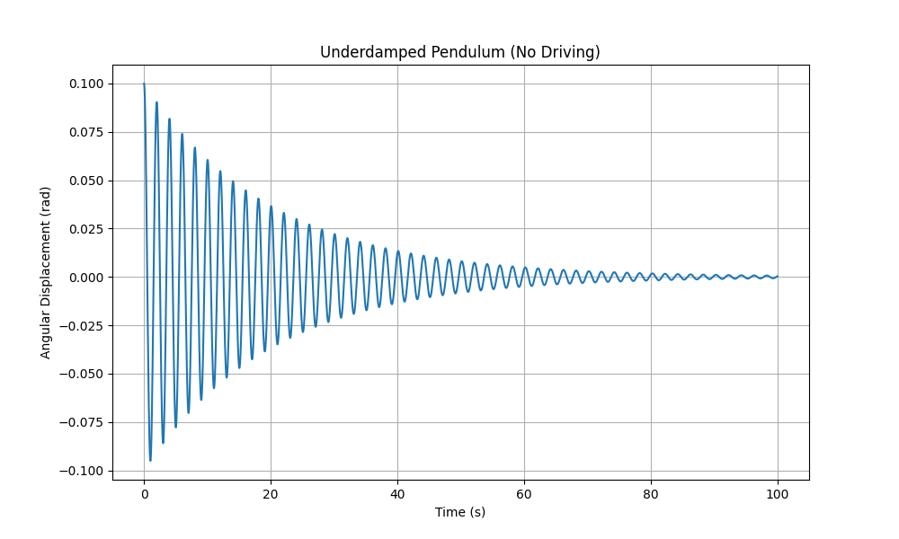
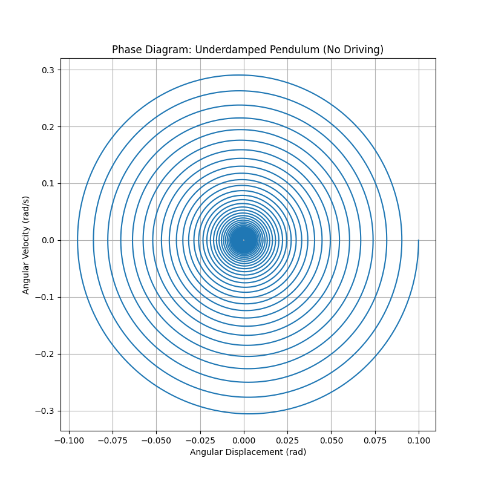
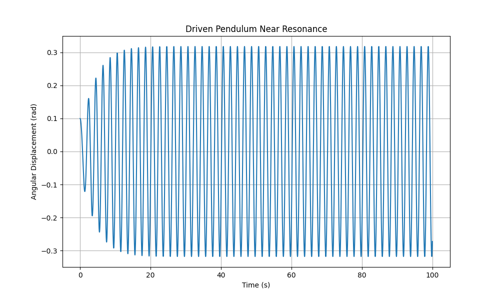
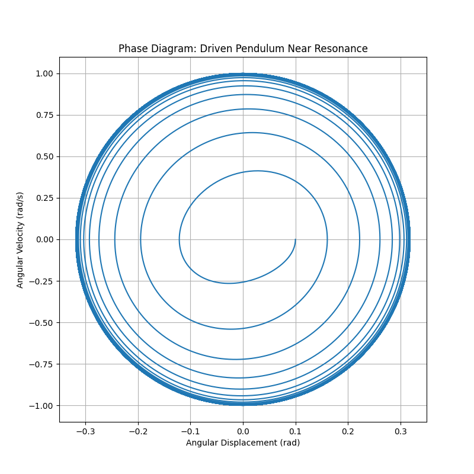
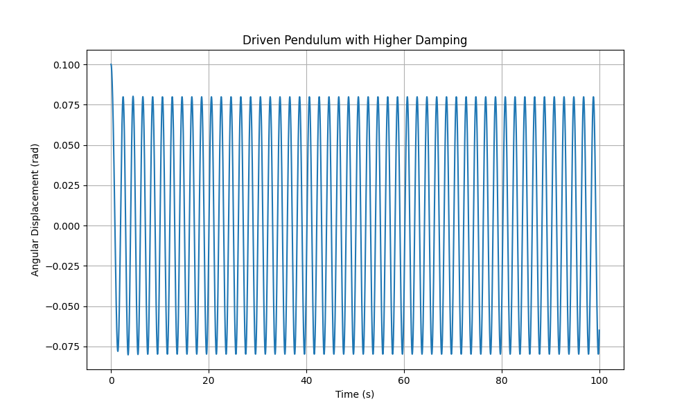
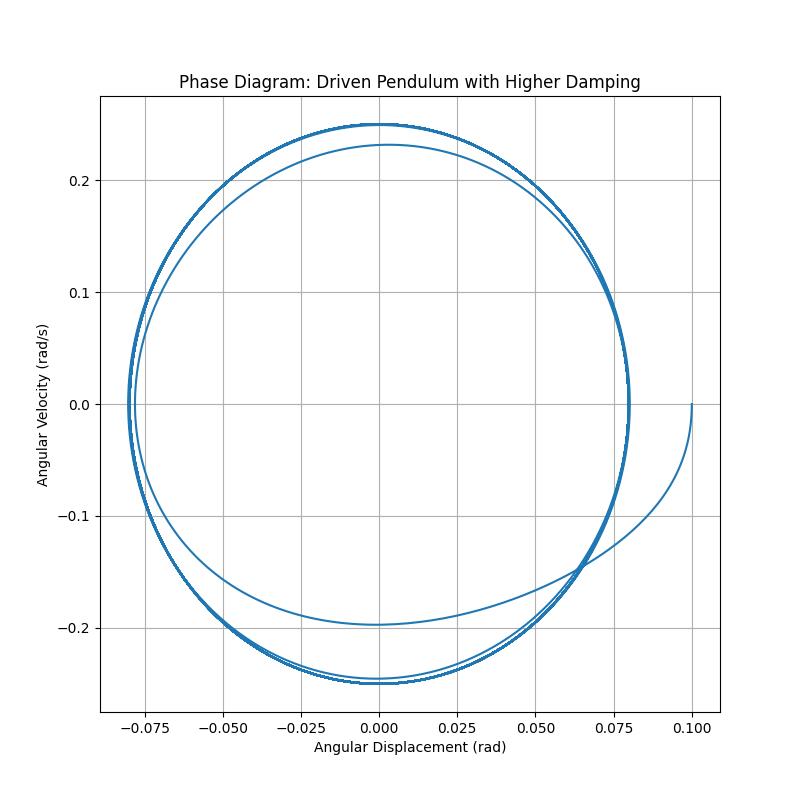
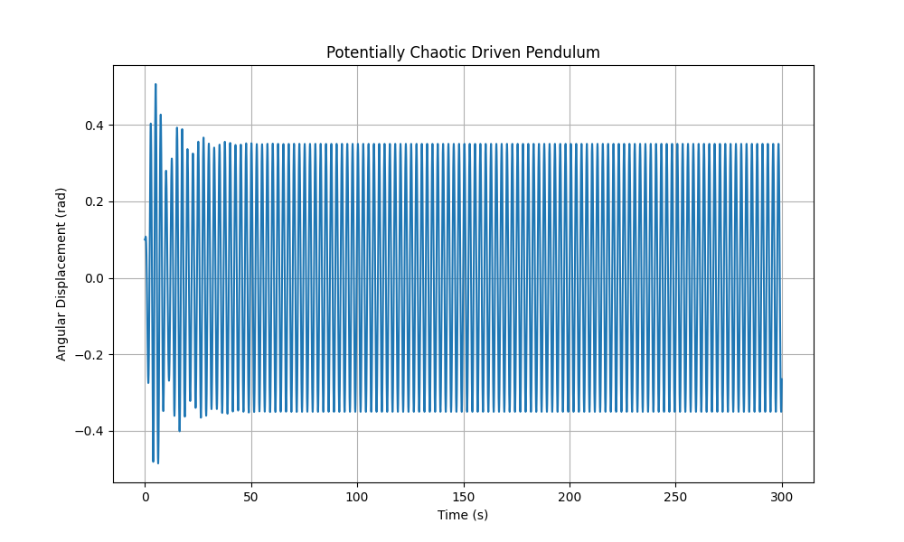
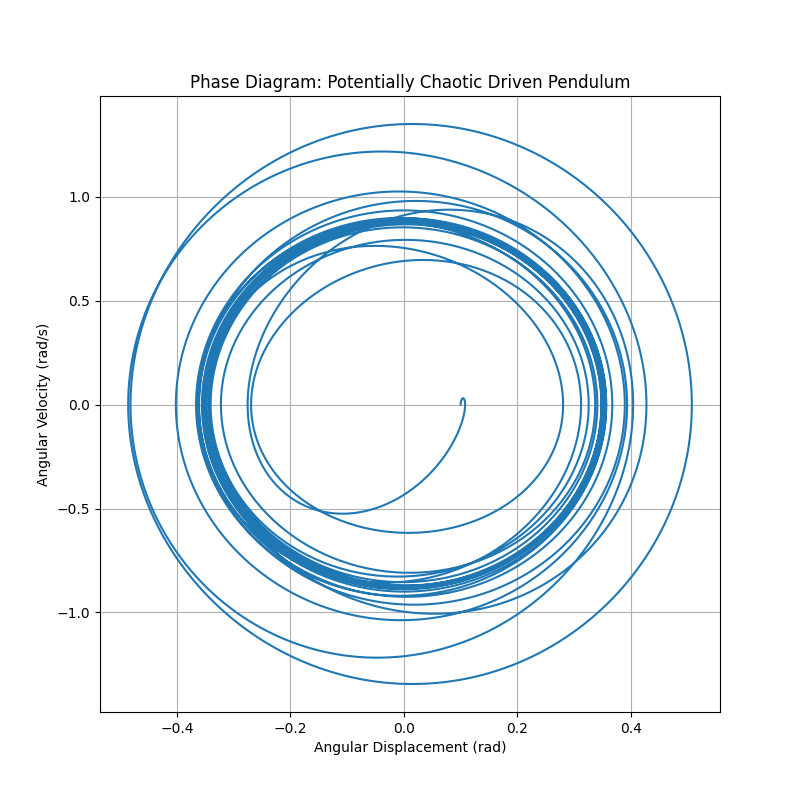
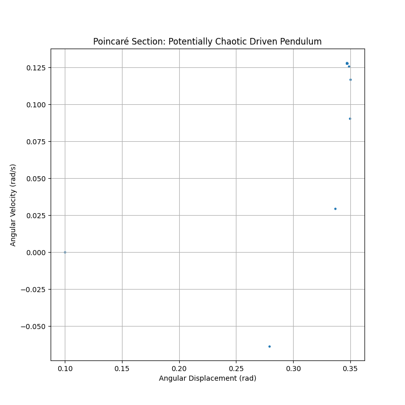

## Problem 2: Investigating the Dynamics of a Forced Damped Pendulum

### 1 Theoretical Foundation

The motion of a forced damped pendulum is governed by the following second-order non-linear differential equation:

$\frac{d^2\theta}{dt^2} + b\frac{d\theta}{dt} + \frac{g}{L}\sin\theta = A\cos(\omega t)$

where:
* $\theta(t)$ is the angular displacement of the pendulum from the vertical.
* $t$ is time.
* $b$ is the damping coefficient (representing energy dissipation).
* $g$ is the acceleration due to gravity.
* $L$ is the length of the pendulum.
* $A$ is the amplitude of the driving force (normalized by mass and length).
* $\omega$ is the angular frequency of the driving force.

#### 1.1 Approximate Solutions for Small-Angle Oscillations

For small angles, we can use the approximation $\sin\theta \approx \theta$. This simplifies the equation to a linear second-order non-homogeneous differential equation:

$\frac{d^2\theta}{dt^2} + b\frac{d\theta}{dt} + \omega_0^2\theta = A\cos(\omega t)$

where $\omega_0 = \sqrt{\frac{g}{L}}$ is the natural angular frequency of the undamped pendulum.

The general solution to this equation consists of two parts: the homogeneous solution (transient behavior) and the particular solution (steady-state behavior).

**Homogeneous Solution:**

The homogeneous equation is $\frac{d^2\theta}{dt^2} + b\frac{d\theta}{dt} + \omega_0^2\theta = 0$. The form of the homogeneous solution depends on the discriminant of the characteristic equation $r^2 + br + \omega_0^2 = 0$, which is $\Delta = b^2 - 4\omega_0^2$.

* **Overdamped ($b^2 > 4\omega_0^2$):** $\theta_h(t) = C_1e^{r_1t} + C_2e^{r_2t}$, where $r_{1,2} = \frac{-b \pm \sqrt{b^2 - 4\omega_0^2}}{2}$ are real and negative. The oscillations decay exponentially without oscillating.
* **Critically Damped ($b^2 = 4\omega_0^2$):** $\theta_h(t) = (C_1 + C_2t)e^{-\frac{b}{2}t}$. The oscillations decay as quickly as possible without oscillating.
* **Underdamped ($b^2 < 4\omega_0^2$):** $\theta_h(t) = e^{-\frac{b}{2}t}(C_1\cos(\omega_d t) + C_2\sin(\omega_d t)) = C e^{-\frac{b}{2}t}\cos(\omega_d t - \phi)$, where $\omega_d = \sqrt{\omega_0^2 - \frac{b^2}{4}}$ is the damped angular frequency, and $C$ and $\phi$ are constants determined by initial conditions. The oscillations decay exponentially with a frequency lower than the natural frequency.



This plot shows the angular displacement of the pendulum over time, exhibiting a decaying sinusoidal oscillation as expected for an underdamped system.



This phase diagram illustrates the trajectory of the underdamped pendulum in phase space, spiraling towards the equilibrium point (0, 0).

**Particular Solution (Steady-State):**

We assume a particular solution of the form $\theta_p(t) = \Theta\cos(\omega t - \delta)$, where $\Theta$ is the amplitude of the forced oscillations and $\delta$ is the phase lag relative to the driving force. Substituting this into the linear equation and solving for $\Theta$ and $\delta$ yields:

$\Theta = \frac{A}{\sqrt{(\omega_0^2 - \omega^2)^2 + (b\omega)^2}}$

$\delta = \arctan\left(\frac{b\omega}{\omega_0^2 - \omega^2}\right)$

The general solution for small-angle oscillations is the sum of the homogeneous and particular solutions: $\theta(t) = \theta_h(t) + \theta_p(t)$. After a sufficiently long time, the transient homogeneous solution decays to zero, and the system settles into the steady-state oscillation described by $\theta_p(t)$.

#### 1.2 Resonance Conditions and Energy Implications

Resonance occurs when the driving frequency $\omega$ is close to the natural frequency of the system. In the case of the forced damped pendulum (under the small-angle approximation), the amplitude of the steady-state oscillations $\Theta$ is maximized when the denominator in the expression for $\Theta$ is minimized.

To find the resonance frequency, we can take the derivative of the denominator squared with respect to $\omega$ and set it to zero:

$\frac{d}{d\omega}[(\omega_0^2 - \omega^2)^2 + (b\omega)^2] = 2(\omega_0^2 - \omega^2)(-2\omega) + 2(b\omega)b = 0$

$-4\omega(\omega_0^2 - \omega^2) + 2b^2\omega = 0$

If $\omega \neq 0$, then $-2(\omega_0^2 - \omega^2) + b^2 = 0$, which gives the resonance frequency $\omega_r$:

$\omega_r = \sqrt{\omega_0^2 - \frac{b^2}{2}}$

This resonance frequency is slightly lower than the natural frequency $\omega_0$ when damping is present. For small damping ($b \ll \omega_0$), $\omega_r \approx \omega_0$.

**Implications for Energy:**

At resonance, the driving force is most effectively transferring energy to the pendulum. The energy input from the driving force compensates for the energy dissipated by damping, leading to oscillations with the largest possible amplitude for a given driving amplitude.

The power supplied by the driving force is $P_{in}(t) = F_{drive}(t) \cdot v(t)$, where $F_{drive}(t) = mA\cos(\omega t)$ (assuming mass $m$ is implicitly included in $A$) and $v(t) = L\frac{d\theta}{dt}$. The average power input over a cycle is equal to the average power dissipated by damping, $P_{dissipated} = b \langle (\frac{d\theta}{dt})^2 \rangle$. At resonance, the energy transfer is maximized, which can lead to very large amplitudes if damping is small.

### 2 Analysis of Dynamics

The dynamics of the forced damped pendulum are significantly influenced by the damping coefficient ($b$), driving amplitude ($A$), and driving frequency ($\omega$).

#### 2.1 Influence of Parameters

* **Damping Coefficient ($b$):**
    * Higher damping leads to faster decay of transient oscillations.
    * Higher damping reduces the amplitude of steady-state oscillations, especially near resonance.
    * Very high damping can prevent oscillations altogether in the homogeneous case (overdamped).
    * In the forced case, high damping broadens the resonance peak and reduces its height.



This plot shows the large amplitude oscillations when the driving frequency is close to the natural frequency of the pendulum.



The phase diagram shows a limit cycle, indicating sustained oscillations at the driving frequency.



This plot illustrates how increased damping reduces the amplitude of the forced oscillations.



The phase diagram shows a smaller limit cycle compared to the resonance case, reflecting the reduced amplitude due to higher damping.

* **Driving Amplitude ($A$):**
    * The driving amplitude directly scales the amplitude of the steady-state oscillations in the linear regime (small angles).
    * In the non-linear regime (large angles), increasing the driving amplitude can lead to more complex behaviors, including chaos.

* **Driving Frequency ($\omega$):**
    * The driving frequency determines the frequency of the steady-state oscillations.
    * When $\omega$ is near the natural frequency $\omega_0$, resonance occurs, leading to large amplitude oscillations.
    * For frequencies far from $\omega_0$, the amplitude of oscillations is generally smaller.
    * In the non-linear regime, different driving frequencies can excite subharmonic or superharmonic oscillations, as well as chaotic behavior.

#### 2.2 Transition Between Regular and Chaotic Motion

The forced damped pendulum is a classic example of a system that can exhibit chaotic behavior. Chaos arises from the non-linearity of the $\sin\theta$ term in the equation of motion. The transition to chaos typically occurs as one or more parameters (e.g., driving amplitude, driving frequency) are varied.

**Routes to Chaos:**

One common route to chaos in this system is through a sequence of period-doubling bifurcations. As a parameter is increased, the system might oscillate with a period $T = \frac{2\pi}{\omega}$. At a critical parameter value, this oscillation becomes unstable, and the system transitions to an oscillation with period $2T$. Further increases in the parameter can lead to oscillations with periods $4T, 8T, 16T, ...$, eventually leading to chaotic motion with no well-defined period.

**Characteristics of Chaotic Motion:**

* **Sensitivity to Initial Conditions:** Small differences in the initial conditions of the pendulum lead to exponentially diverging trajectories in phase space. This is often referred to as the "butterfly effect."
* **Aperiodic Behavior:** The motion is irregular and does not repeat in a predictable pattern.
* **Strange Attractors:** In phase space, the trajectories of chaotic motion are confined to a bounded region called a strange attractor. These attractors have a complex fractal structure.



This plot shows the irregular and non-periodic motion characteristic of a potentially chaotic forced damped pendulum.



The phase diagram reveals a complex, swirling pattern, suggesting the presence of a strange attractor.



The Poincaré section shows a scattering of points forming a complex structure, further indicating chaotic behavior.

**Physical Interpretations:**

The transition to chaos in a forced damped pendulum signifies a breakdown of predictable, regular motion. The pendulum's response to the driving force becomes highly sensitive to even tiny perturbations, making long-term predictions impossible. This behavior can be observed in various physical systems and has implications for fields ranging from weather forecasting to the stability of mechanical structures.

### 3 Practical Applications

The forced damped pendulum model has numerous real-world applications, including:

* **Energy Harvesting Devices:** Pendulum-based energy harvesters can be designed to resonate with ambient vibrations, converting mechanical energy into electrical energy. Understanding the resonance conditions and the effects of damping is crucial for optimizing the efficiency of these devices.
* **Suspension Bridges:** The Tacoma Narrows Bridge collapse in 1940 is a dramatic example of how external periodic forces (wind) can drive a structure into resonance, leading to catastrophic failure. The principles of forced oscillations and damping are essential in the design and analysis of large structures like bridges to prevent such events.
* **Oscillating Circuits (RLC Circuits):** The behavior of a driven RLC circuit is mathematically analogous to a forced damped mechanical oscillator. The charge on the capacitor or the current in the inductor oscillates in response to a periodic voltage source. Resonance phenomena in RLC circuits are fundamental to radio tuning and filter design.
* **Mechanical Metronomes:** These devices use a pendulum to provide a regular beat for music. The damping ensures that the oscillations decay slowly, and the driving force (often through a clockwork mechanism) maintains a constant amplitude.
* **Seismology:** The response of buildings and other structures to seismic waves can be modeled as forced damped oscillations. Understanding the natural frequencies of structures and the frequencies present in earthquakes is crucial for designing earthquake-resistant buildings.
* **Biomechanics (Human Gait):** The motion of limbs during walking or running can be approximated as damped oscillations driven by muscle forces. The concepts of resonance and energy efficiency are relevant in understanding human locomotion.
* **Climate Systems:** While much more complex, some aspects of climate variability can be conceptualized as oscillations driven by periodic forcing (e.g., solar radiation) and influenced by damping mechanisms (e.g., heat dissipation).

## 4 Implementation

We will now create a computational model of the forced damped pendulum using Python. We will use the `scipy.integrate.solve_ivp` function to numerically solve the second-order differential equation and `matplotlib` for visualization.

```python
import numpy as np
import matplotlib.pyplot as plt
from scipy.integrate import solve_ivp

# Define the parameters of the pendulum
L = 1.0  # Length of the pendulum (m)
g = 9.81 # Acceleration due to gravity (m/s^2)

def pendulum_equation(t, y, b, A, omega):
    """
    Defines the differential equation for the forced damped pendulum.

    Args:
        t (float): Time.
        y (numpy.ndarray): Array containing the angular displacement (theta) and angular velocity (dtheta/dt).
        b (float): Damping coefficient.
        A (float): Driving amplitude.
        omega (float): Driving frequency.

    Returns:
        numpy.ndarray: Array containing the derivatives dtheta/dt and d^2theta/dt^2.
    """
    theta, omega_dot = y
    dtheta_dt = omega_dot
    domega_dt = -b * omega_dot - (g / L) * np.sin(theta) + A * np.cos(omega * t)
    return [dtheta_dt, domega_dt]

def simulate_pendulum(initial_angle, initial_velocity, t_span, t_eval, b, A, omega):
    """
    Simulates the motion of the forced damped pendulum.

    Args:
        initial_angle (float): Initial angular displacement (radians).
        initial_velocity (float): Initial angular velocity (radians/s).
        t_span (tuple): Time interval of the simulation (start, end).
        t_eval (numpy.ndarray): Array of time points at which to store the solution.
        b (float): Damping coefficient.
        A (float): Driving amplitude.
        omega (float): Driving frequency.

    Returns:
        scipy.integrate.OdeResult: Object containing the solution.
    """
    initial_conditions = [initial_angle, initial_velocity]
    solution = solve_ivp(pendulum_equation, t_span, initial_conditions,
                         t_eval=t_eval, args=(b, A, omega),
                         dense_output=True, rtol=1e-8, atol=1e-8)
    return solution

def plot_motion(t, theta, title):
    """
    Plots the angular displacement as a function of time.

    Args:
        t (numpy.ndarray): Time array.
        theta (numpy.ndarray): Angular displacement array.
        title (str): Title of the plot.
    """
    plt.figure(figsize=(10, 6))
    plt.plot(t, theta)
    plt.xlabel("Time (s)")
    plt.ylabel("Angular Displacement (rad)")
    plt.title(title)
    plt.grid(True)
    plt.show()

def plot_phase_diagram(theta, omega_dot, title):
    """
    Plots the phase diagram (angular velocity vs. angular displacement).

    Args:
        theta (numpy.ndarray): Angular displacement array.
        omega_dot (numpy.ndarray): Angular velocity array.
        title (str): Title of the plot.
    """
    plt.figure(figsize=(8, 8))
    plt.plot(theta, omega_dot)
    plt.xlabel("Angular Displacement (rad)")
    plt.ylabel("Angular Velocity (rad/s)")
    plt.title(title)
    plt.grid(True)
    plt.show()

def plot_poincare_section(t, theta, omega_dot, driving_period, title):
    """
    Plots the Poincaré section by sampling points at integer multiples of the driving period.

    Args:
        t (numpy.ndarray): Time array.
        theta (numpy.ndarray): Angular displacement array.
        omega_dot (numpy.ndarray): Angular velocity array.
        driving_period (float): Period of the driving force (2*pi/omega).
        title (str): Title of the plot.
    """
    poincare_theta =
    poincare_omega_dot =
    for i, time in enumerate(t):
        if np.isclose(time % driving_period, 0.0, atol=1e-3):
            poincare_theta.append(theta[i])
            poincare_omega_dot.append(omega_dot[i])

    plt.figure(figsize=(8, 8))
    plt.scatter(poincare_theta, poincare_omega_dot, s=5)
    plt.xlabel("Angular Displacement (rad)")
    plt.ylabel("Angular Velocity (rad/s)")
    plt.title(title)
    plt.grid(True)
    plt.show()

if __name__ == "__main__":
    # Example parameters
    initial_angle = 0.1  # radians
    initial_velocity = 0.0  # radians/s
    t_span = (0, 100)  # Simulation time span (seconds)
    t_eval = np.linspace(t_span[0], t_span[1], 10000)

    # Case 1: Underdamped, no driving force
    b1 = 0.1
    A1 = 0.0
    omega1 = np.sqrt(g / L)  # Natural frequency
    sol1 = simulate_pendulum(initial_angle, initial_velocity, t_span, t_eval, b1, A1, omega1)
    plot_motion(sol1.t, sol1.y[0], "Underdamped Pendulum (No Driving)")
    plot_phase_diagram(sol1.y[0], sol1.y[1], "Phase Diagram: Underdamped Pendulum (No Driving)")

    # Case 2: Driven pendulum near resonance
    b2 = 0.5
    A2 = 0.5
    omega2 = np.sqrt(g / L)  # Driving at natural frequency
    sol2 = simulate_pendulum(initial_angle, initial_velocity, t_span, t_eval, b2, A2, omega2)
    plot_motion(sol2.t, sol2.y[0], "Driven Pendulum Near Resonance")
    plot_phase_diagram(sol2.y[0], sol2.y[1], "Phase Diagram: Driven Pendulum Near Resonance")

    # Case 3: Driven pendulum with higher damping
    b3 = 2.0
    A3 = 0.5
    omega3 = np.sqrt(g / L)
    sol3 = simulate_pendulum(initial_angle, initial_velocity, t_span, t_eval, b3, A3, omega3)
    plot_motion(sol3.t, sol3.y[0], "Driven Pendulum with Higher Damping")
    plot_phase_diagram(sol3.y[0], sol3.y[1], "Phase Diagram: Driven Pendulum with Higher Damping")

    # Case 4: Potential for chaotic behavior (higher driving amplitude and different frequency)
    b4 = 0.2
    A4 = 1.2
    omega4 = 0.8 * np.sqrt(g / L)
    sol4 = simulate_pendulum(initial_angle, initial_velocity, (0, 300), np.linspace(0, 300, 30000), b4, A4, omega4)
    plot_motion(sol4.t, sol4.y[0], "Potentially Chaotic Driven Pendulum")
    plot_phase_diagram(sol4.y[0], sol4.y[1], "Phase Diagram: Potentially Chaotic Driven Pendulum")
    driving_period4 = 2 * np.pi / omega4
    plot_poincare_section(sol4.t, sol4.y[0], sol4.y[1], driving_period4, "Poincaré Section: Potentially Chaotic Driven Pendulum")
```
# Python Script for Forced Damped Pendulum Simulation

This Python script defines the differential equation for the forced damped pendulum and provides functions to simulate its motion, plot the angular displacement over time, plot the phase diagram, and generate a Poincaré section. The `if __name__ == "__main__":` block demonstrates simulations for different parameter sets, including cases with no driving, driving near resonance, higher damping, and parameters that might lead to chaotic behavior.

To observe the transition to chaos more systematically, one could vary a parameter (e.g., driving amplitude $A$) and observe the changes in the phase diagrams and Poincaré sections. For regular periodic motion, the Poincaré section will consist of a few discrete points. As the system approaches chaos, the number of points increases, and they can form complex patterns indicative of a strange attractor.

## Visualizing Behavior Under Various Conditions

By running the script with different values for $b$, $A$, and $\omega$, you can observe the following:

- **Small Damping, No Driving:** The pendulum oscillates with a frequency close to its natural frequency, and the amplitude decays slowly. The phase diagram shows a spiral converging to the origin.
- **Driven Near Resonance:** The amplitude of oscillations becomes large, especially if damping is small. The phase diagram shows a limit cycle.
- **Higher Damping:** The amplitude of oscillations is reduced, and the energy dissipation is more significant. The phase diagram shows a limit cycle with a smaller radius compared to the resonance case.
- **Potential Chaos:** For certain parameter values, the motion appears irregular and non-periodic. The phase diagram can show a complex structure, and the Poincaré section can reveal a fractal-like pattern, indicating chaotic behavior.

## 5 Deliverables

This document serves as a detailed explanation of the forced damped pendulum. The Python script provided implements the simulations and generates the requested visualizations.

### 5.1 General Solutions

The general solution for the forced damped pendulum in the small-angle approximation involves a transient component that decays over time and a steady-state sinusoidal oscillation driven by the external force. For large angles, analytical general solutions are not typically available, and numerical methods are required to explore the dynamics.

### 5.2 Graphical Representations

The Python script generates the following graphical representations:

- **Time Series Plots:** Showing the angular displacement as a function of time for different damping coefficients, driving amplitudes, and driving frequencies. This allows visualization of resonance (large amplitude oscillations) and the effects of damping on the amplitude and decay of oscillations.
- **Phase Diagrams:** Plots of angular velocity versus angular displacement. These diagrams provide insights into the system's dynamics, showing trajectories converging to a stable equilibrium point (damped oscillations), closed loops (periodic oscillations), or more complex patterns (chaotic behavior).
- **Poincaré Sections:** For the potentially chaotic case, the Poincaré section is plotted by sampling the state of the pendulum at discrete times corresponding to integer multiples of the driving period. This can reveal the underlying structure of the attractor and help distinguish between periodic and chaotic motion.

To further illustrate transitions to chaos, one could generate a bifurcation diagram. This involves plotting a characteristic of the system's long-term behavior (e.g., the amplitude of oscillation or the values of $\theta$ in the Poincaré section) as a function of a control parameter (e.g., the driving amplitude $A$). Bifurcation diagrams can clearly show the points at which the system undergoes qualitative changes in its behavior, such as period-doubling bifurcations leading to chaos. Implementing the generation of a full bifurcation diagram would require running multiple simulations for a range of parameter values and analyzing the resulting steady-state behavior.

### 5.3 Discussion on Limitations and Potential Extensions

#### Limitations of the Model:

- **Idealized Damping:** The model assumes viscous damping, where the damping force is proportional to the angular velocity. In reality, damping can be more complex and may depend on other factors.
- **Point Mass Approximation:** The pendulum is treated as a point mass concentrated at the end of a massless rod. Real pendulums have mass distributed along their length and may experience more complex dynamics due to their physical dimensions.
- **Rigid Support:** The model assumes a rigid support for the pendulum. If the support itself is subject to vibrations or other movements, the dynamics of the system can be significantly different.
- **Small-Angle Approximation:** The analytical solutions derived for small angles are only valid when $\theta$ remains small. For large-amplitude oscillations, the full non-linear equation must be considered.

#### Potential Extensions:

- **Nonlinear Damping:** Introducing damping forces that are not linearly proportional to velocity (e.g., quadratic damping) would make the model more realistic for some physical systems.
- **Non-Periodic Driving Forces:** Exploring the pendulum's response to non-periodic or stochastic driving forces could provide insights into the behavior of systems under more complex external influences.
- **Parametric Excitation:** Investigating cases where parameters of the system (e.g., length $L$) are varied periodically could lead to interesting phenomena.
- **Coupled Pendulums:** Studying the dynamics of multiple coupled forced damped pendulums can reveal complex collective behaviors and synchronization phenomena.
- **Energy Harvesting Optimization:** Developing more sophisticated models that include the energy conversion mechanism could help in designing more efficient energy harvesting devices.
- **Control Systems:** Investigating how external control forces can be applied to stabilize or modify the pendulum's motion could have applications in robotics and other fields.

By addressing these limitations and exploring potential extensions, the model of the forced damped pendulum can be made more accurate and applicable to a wider range of physical and engineering problems. The transition to chaos and the rich dynamics exhibited by this seemingly simple system continue to be a subject of fascination and research in various scientific disciplines.
