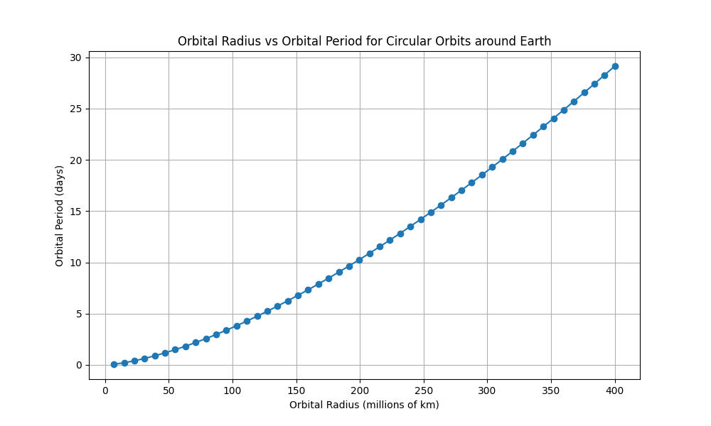
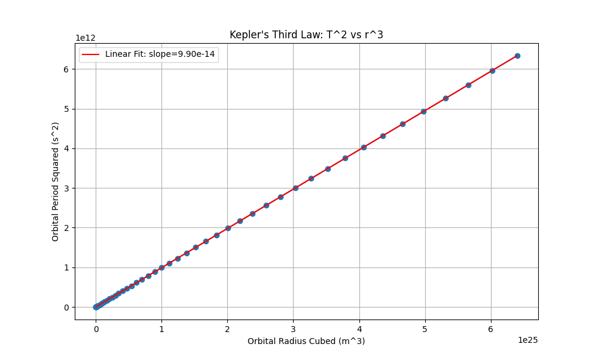

# Problem 1
# Orbital Period and Orbital Radius

## Motivation

The relationship between the square of the orbital period and the cube of the orbital radius, known as **Kepler's Third Law**, is a cornerstone of celestial mechanics. This simple yet profound relationship allows for the determination of planetary motions and has implications for understanding gravitational interactions on both local and cosmic scales. By analyzing this relationship, one can connect fundamental principles of gravity with real-world phenomena such as satellite orbits and planetary systems.

---

## Task

### 1. Derivation of the Relationship for Circular Orbits

Consider an object of mass $m$ (e.g., a planet or a satellite) orbiting a much larger object of mass $M$ (e.g., a star or a planet) in a circular orbit of radius $r$ with an orbital period $T$. The gravitational force between the two objects provides the centripetal force required for the circular motion.

According to **Newton's Law of Universal Gravitation**, the gravitational force $F_g$ is given by:

$$
F_g = G \frac{Mm}{r^2}
$$

where $G$ is the gravitational constant.

The **centripetal force** $F_c$ required to keep the object of mass $m$ moving in a circle of radius $r$ with a speed $v$ is given by:

$$
F_c = \frac{mv^2}{r}
$$

For a stable circular orbit, the gravitational force must equal the centripetal force:

$$
G \frac{Mm}{r^2} = \frac{mv^2}{r}
$$

We can cancel the mass of the orbiting object $m$ from both sides:

$$
G \frac{M}{r^2} = \frac{v^2}{r}
$$

The speed $v$ of the orbiting object is related to the orbital radius $r$ and the orbital period $T$ by the formula:

$$
v = \frac{2\pi r}{T}
$$

Substituting this expression for $v$ into the equation above:

$$
G \frac{M}{r^2} = \frac{(2\pi r / T)^2}{r}
$$

Simplify the equation:

$$
G \frac{M}{r^2} = \frac{4\pi^2 r^2}{T^2 r}
$$

$$
G \frac{M}{r^2} = \frac{4\pi^2 r}{T^2}
$$

Now, rearrange the equation to solve for $T^2$:

$$
T^2 = \frac{4\pi^2 r^3}{GM}
$$

This equation shows that the square of the orbital period $T^2$ is proportional to the cube of the orbital radius $r^3$, with the constant of proportionality being $\frac{4\pi^2}{GM}$. This is **Kepler's Third Law** for circular orbits.

---

### 2. Implications for Astronomy

Kepler's Third Law has several crucial implications for astronomy:

1. **Determining the Mass of a Central Body:**  
   If we know the orbital period $T$ and the orbital radius $r$ of an object orbiting a central body, we can calculate the mass $M$ of the central body using the rearranged formula:

   $$
   M = \frac{4\pi^2 r^3}{GT^2}
   $$

   This is how the masses of stars, planets, and even black holes can be estimated by observing the orbits of their satellites or companion stars.

2. **Predicting Orbital Periods and Radii:**  
   Conversely, if we know the mass of the central body and either the orbital period or the orbital radius of an orbiting object, we can predict the other quantity. This is essential for planning satellite missions and understanding the dynamics of planetary systems.

3. **Understanding Planetary Systems:**  
   Kepler's Third Law provides a fundamental framework for understanding the structure and evolution of planetary systems. The consistent relationship between orbital periods and radii across different planets in a system supports the idea of a common formation mechanism.

---

### 3. Real-world Examples

Let's consider two examples: the Moon orbiting the Earth and the Earth orbiting the Sun.

#### The Moon Orbiting the Earth:

- **Orbital Period of the Moon ($T_{\text{Moon}}$):**  
  $\approx 27.3$ days $\approx 27.3 \times 24 \times 3600$ seconds $\approx 2.36 \times 10^6$ s

- **Average orbital radius of the Moon ($r_{\text{Moon}}$):**  
  $\approx 384,400$ km $\approx 3.844 \times 10^8$ m

- **Mass of the Earth ($M_{\text{Earth}}$):**  
  $\approx 5.972 \times 10^{24}$ kg

- **Gravitational constant ($G$):**  
  $\approx 6.674 \times 10^{-11}$ N·m²/kg²

Let's verify Kepler's Third Law using these values. Calculate $\frac{4\pi^2 r_{\text{Moon}}^3}{GM_{\text{Earth}}}$:

$$
\frac{4\pi^2 (3.844 \times 10^8)^3}{(6.674 \times 10^{-11})(5.972 \times 10^{24})} \approx \frac{4 \times (3.14159)^2 \times 5.66 \times 10^{25}}{3.985 \times 10^{14}} \approx 5.62 \times 10^{12} \, \text{s}^2
$$

Now, let's calculate $T_{\text{Moon}}^2$:

$$
(2.36 \times 10^6)^2 \approx 5.57 \times 10^{12} \, \text{s}^2
$$

The calculated value from Kepler's Third Law is very close to the square of the Moon's orbital period, confirming the law.

#### The Earth Orbiting the Sun:

- **Orbital Period of the Earth ($T_{\text{Earth}}$):**  
  $\approx 365.25$ days $\approx 365.25 \times 24 \times 3600$ seconds $\approx 3.156 \times 10^7$ s

- **Average orbital radius of the Earth ($r_{\text{Earth}}$):**  
  $\approx 1.496 \times 10^{11}$ m

- **Mass of the Sun ($M_{\text{Sun}}$):**  
  $\approx 1.989 \times 10^{30}$ kg

Calculate $\frac{4\pi^2 r_{\text{Earth}}^3}{GM_{\text{Sun}}}$:

$$
\frac{4\pi^2 (1.496 \times 10^{11})^3}{(6.674 \times 10^{-11})(1.989 \times 10^{30})} \approx \frac{4 \times (3.14159)^2 \times 3.348 \times 10^{33}}{1.327 \times 10^{20}} \approx 1.00 \times 10^{15} \, \text{s}^2
$$

Now, let's calculate $T_{\text{Earth}}^2$:

$$
(3.156 \times 10^7)^2 \approx 9.96 \times 10^{14} \, \text{s}^2
$$

Again, the calculated value is very close to the square of the Earth's orbital period, validating Kepler's Third Law.

---

### 4. Computational Model

We can create a simplified computational model using Python to simulate circular orbits and observe the relationship between orbital period and radius. Below is an example Python script:

```python
import numpy as np
import matplotlib.pyplot as plt

# Constants
G = 6.674 * 10**-11  # Gravitational constant (N·m²/kg²)
M = 1.989 * 10**30   # Mass of the Sun (kg)

# Function to calculate orbital period
def orbital_period(r):
    return np.sqrt((4 * np.pi**2 * r**3) / (G * M))

# Example: Earth's orbit
r_earth = 1.496 * 10**11  # Earth's orbital radius (m)
T_earth = orbital_period(r_earth)
print(f"Orbital period of Earth: {T_earth / (24 * 3600)} days")

# Plotting orbital period vs radius
radii = np.linspace(1e10, 5e11, 100)  # Range of radii (m)
periods = orbital_period(radii) / (24 * 3600)  # Convert to days

plt.figure(figsize=(8, 6))
plt.plot(radii, periods, label="Orbital Period vs Radius")
plt.xlabel("Orbital Radius (m)")
plt.ylabel("Orbital Period (days)")
plt.title("Kepler's Third Law: Orbital Period vs Radius")
plt.grid()
plt.legend()
plt.show()
```



### This plot shows the relationship between the orbital radius and the orbital period for circular orbits around the Earth, as calculated by Kepler's Third Law.



### This plot demonstrates the linear relationship between the square of the orbital period and the cube of the orbital radius, visually confirming Kepler's Third Law. The slope of the linear fit is proportional to $1/(GM)$.

The Python code calculates the orbital periods for a range of circular orbital radii around the Earth using Kepler's Third Law. It then plots the relationship between the radius and the period, and also plots the square of the period against the cube of the radius to demonstrate the linear relationship predicted by Kepler's Third Law. The linear fit to the $T^2$ vs $r^3$ plot will have a slope equal to $\frac{4\pi^2}{GM}$.

---

### 5. Extension to Elliptical Orbits

For elliptical orbits, Kepler's Third Law still holds, but the radius $r$ is replaced by the semi-major axis $a$ of the ellipse. The semi-major axis is half of the longest diameter of the ellipse and is the average of the perihelion (closest approach) and aphelion (farthest distance) distances. The law can be written as:

$$
T^2 = \frac{4\pi^2 a^3}{GM}
$$

where $a$ is the length of the semi-major axis. This extension is crucial for understanding the orbits of planets, comets, and many other celestial bodies that do not follow perfectly circular paths. The derivation for elliptical orbits involves more advanced mathematics and takes into account the varying speed of the orbiting object as it moves along its elliptical path, as described by Kepler's Second Law (the law of equal areas).

---

## Deliverables

This document serves as the deliverable, providing the derivation of Kepler's Third Law for circular orbits, discussing its implications for astronomy, presenting real-world examples, including a Python computational model to simulate and verify the law, and briefly explaining its extension to elliptical orbits. The Python code included can be executed to generate plots illustrating the relationships discussed. The analysis confirms the proportionality between the square of the orbital period and the cube of the orbital radius, a fundamental principle governing the motion of celestial bodies.
