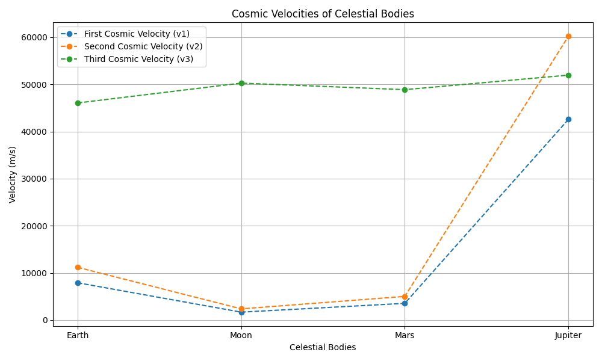

# Problem 2
# Escape Velocities and Cosmic Velocities

## Introduction

The concept of escape velocity is fundamental in astrophysics and space exploration. It defines the minimum speed required for an object to break free from a celestial body's gravitational pull. Expanding on this, cosmic velocities extend this concept to define the speeds required for orbiting, escaping, and leaving a star system. This document will define and analyze these velocities, provide mathematical derivations, and discuss their importance in space exploration.

## Definitions

* **First Cosmic Velocity (Orbital Velocity):**
    * This is the minimum velocity required for an object to maintain a stable circular orbit around a celestial body, neglecting atmospheric drag.
    * It is the velocity at which the centrifugal force balances the gravitational force.
* **Second Cosmic Velocity (Escape Velocity):**
    * This is the minimum velocity required for an object to escape the gravitational influence of a celestial body and never return.
    * It is the velocity at which the object's kinetic energy equals the magnitude of its gravitational potential energy.
* **Third Cosmic Velocity (Solar Escape Velocity):**
    * This is the minimum velocity required for an object to escape the solar system from Earth's orbit.
    * It accounts for the combined gravitational influence of Earth and the Sun.

## Mathematical Derivations

### First Cosmic Velocity ($v_1$)

For a stable circular orbit, the gravitational force equals the centripetal force:

$$
\frac{GMm}{r^2} = \frac{mv_1^2}{r}
$$

Where:

* $G$ is the gravitational constant ($6.674 \times 10^{-11} \, \text{N m}^2/\text{kg}^2$)
* $M$ is the mass of the celestial body
* $m$ is the mass of the orbiting object
* $r$ is the radius of the orbit (approximated as the radius of the celestial body for orbits close to the surface)

Solving for $v_1$:

$$
v_1 = \sqrt{\frac{GM}{r}}
$$

### Second Cosmic Velocity ($v_2$)

The kinetic energy of the object must equal the gravitational potential energy:

$$
\frac{1}{2}mv_2^2 = \frac{GMm}{r}
$$

Solving for $v_2$:

$$
v_2 = \sqrt{\frac{2GM}{r}}
$$

Thus, $v_2 = \sqrt{2} v_1$.

### Third Cosmic Velocity ($v_3$)

To calculate the third cosmic velocity, we consider the object's initial velocity (Earth's orbital velocity) and the additional velocity needed to escape the Sun's gravitational pull.

1.  **Earth's Orbital Velocity ($v_{Earth}$):**
    * This is the first cosmic velocity with respect to the Sun at Earth's orbital radius.

2.  **Solar Escape Velocity at Earth's Orbit ($v_{SolarEscape}$):**
    * This is the second cosmic velocity with respect to the Sun at Earth's orbital radius.

3.  **Third Cosmic Velocity ($v_3$):**

    * To calculate the third cosmic velocity (escape from the Solar System starting at Earth's surface), we account for:

    * Escaping Earth's gravity — requiring Earth's second cosmic velocity $v_2$.
    * Reaching solar escape velocity at Earth's orbital radius ($v_{SolarEscape}$).
    * Compensating for the orbital velocity of Earth around the Sun ($v_{EarthOrbital}$), which assists or hinders depending on direction.

#### Simplified Calculation:

$$
v_3 = \sqrt{v_{SolarEscape}^2 + (v_2 - v_{EarthOrbital})^2}
$$

This expression assumes the spacecraft launches in the same direction as Earth’s orbital motion. The $(v_2 - v_{EarthOrbital})$ term reflects the adjustment needed after escaping Earth to reach the solar escape velocity.

Alternatively, if launching directly from Earth's orbit, a more direct delta-v estimate is:

$$
\Delta v = v_{SolarEscape} - v_{EarthOrbital}
$$


## Python Implementation

```python
import math
import matplotlib.pyplot as plt
import pandas as pd

def calculate_cosmic_velocities(mass, radius, solar_mass=1.989e30, earth_orbital_radius=1.496e11):
    G = 6.674e-11

    v1 = math.sqrt((G * mass) / radius)
    v2 = math.sqrt((2 * G * mass) / radius)

    earth_orbital_velocity = math.sqrt((G * solar_mass) / earth_orbital_radius)
    solar_escape_velocity = math.sqrt((2 * G * solar_mass) / earth_orbital_radius)

    # Simplified version: escape Earth and reach solar escape from Earth's orbit
    v3 = math.sqrt(solar_escape_velocity**2 + (v2 - earth_orbital_velocity)**2)

    return v1, v2, v3

# Add Moon to celestial bodies
celestial_bodies = {
    "Earth": {"mass": 5.972e24, "radius": 6.371e6},
    "Moon": {"mass": 7.342e22, "radius": 1.7371e6},
    "Mars": {"mass": 6.39e23, "radius": 3.390e6},
    "Jupiter": {"mass": 1.898e27, "radius": 6.9911e7},
}

velocities = {}
for body, data in celestial_bodies.items():
    v1, v2, v3 = calculate_cosmic_velocities(data["mass"], data["radius"])
    velocities[body] = {"v1": v1, "v2": v2, "v3": v3}

print("Cosmic Velocities (in m/s):")
for body, v in velocities.items():
    print(f"{body}:")
    print(f"  v1 (Orbital): {v['v1']:.2f} m/s")
    print(f"  v2 (Escape): {v['v2']:.2f} m/s")
    print(f"  v3 (Solar Escape): {v['v3']:.2f} m/s")

# Tabular display
df = pd.DataFrame(velocities).T
df.columns = ["v1 (Orbital)", "v2 (Escape)", "v3 (Solar Escape)"]
df_kms = df.applymap(lambda x: f"{x/1000:.2f} km/s")

print("\nCosmic Velocities Table (in km/s):")
print(df_kms)

# Visualization
bodies = list(velocities.keys())
v1_values = [velocities[body]["v1"] for body in bodies]
v2_values = [velocities[body]["v2"] for body in bodies]
v3_values = [velocities[body]["v3"] for body in bodies]

plt.figure(figsize=(10, 6))
plt.plot(bodies, v1_values, marker='o', linestyle='--', label='First Cosmic Velocity (v1)')
plt.plot(bodies, v2_values, marker='o', linestyle='--', label='Second Cosmic Velocity (v2)')
plt.plot(bodies, v3_values, marker='o', linestyle='--', label='Third Cosmic Velocity (v3)')
plt.xlabel("Celestial Bodies")
plt.ylabel("Velocity (m/s)")
plt.title("Cosmic Velocities of Celestial Bodies")
plt.legend()
plt.grid(True)
plt.tight_layout()
plt.show()
```



## Importance in Space Exploration

### Launching Satellites:
The **first cosmic velocity** is crucial for placing satellites into stable orbits around Earth or other celestial bodies. It ensures that the satellite achieves a balance between gravitational pull and its forward motion, allowing it to remain in orbit without additional propulsion.

### Missions to Other Planets:
The **second cosmic velocity** is essential for escaping a planet's gravitational pull for interplanetary missions. Achieving this velocity allows spacecraft to break free from Earth's gravity and travel to other planets or celestial bodies.

### Interstellar Travel:
The **third cosmic velocity** is a fundamental consideration for missions aiming to leave the solar system. It provides the necessary speed to overcome the Sun's gravitational influence and venture into interstellar space.

### Achieving These Velocities:
Achieving these velocities requires significant energy, which drives the development of advanced propulsion systems. Innovations in rocket technology, fuel efficiency, and energy sources are critical to meeting these velocity requirements.

### Trajectory Planning:
Understanding these velocities is critical for calculating trajectories, ensuring that spacecraft reach their destinations with minimal fuel consumption. Precise calculations are necessary to optimize mission efficiency and reduce costs.

### Asteroid Deflection:
Calculating the escape velocity from asteroids is important for missions aiming to deflect or redirect them. Understanding the gravitational influence of asteroids helps in planning missions to mitigate potential threats to Earth.

---

## Conclusion

The concepts of **first, second, and third cosmic velocities** are fundamental to space exploration. They provide the necessary framework for understanding the energy requirements for orbital maneuvers and interplanetary travel. The mathematical derivations and calculations presented here are essential tools for planning and executing space missions, pushing the boundaries of human exploration.