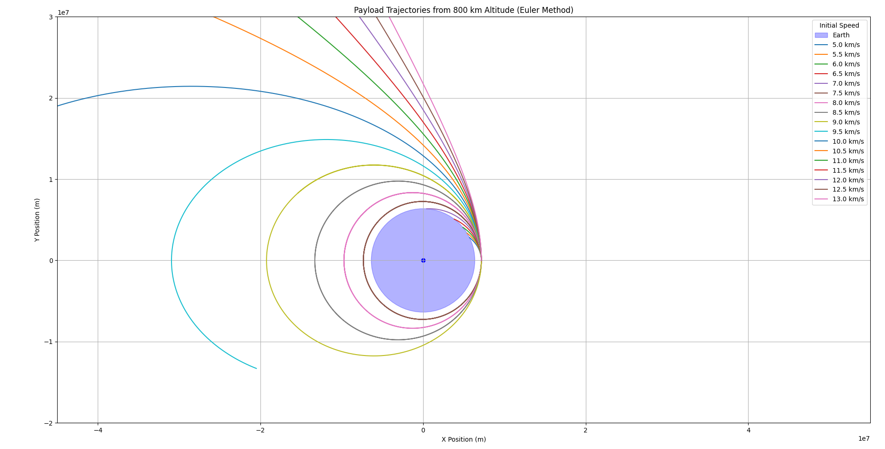

# Problem 3
# Trajectories of a Freely Released Payload Near Earth

## Introduction

Understanding the motion of objects under the influence of Earth's gravity is fundamental to space exploration. When a payload is released from a moving rocket near Earth, its subsequent trajectory is governed by its initial conditions (position and velocity at the time of release) and the gravitational force exerted by Earth. This problem explores the different types of trajectories possible and provides a computational tool to simulate and visualize these paths.

---

## Theoretical Background

The motion of the payload is primarily governed by **Newton's Law of Universal Gravitation**, which states that every particle in the universe attracts every other particle with a force that is directly proportional to the product of their masses and inversely proportional to the square of the distance between their centers. Mathematically, the force $F$ exerted by Earth (mass $M$) on the payload (mass $m$) is given by:

$$
F = -G \frac{Mm}{r^2} \hat{r}
$$

where:
- $G$ is the universal gravitational constant ($6.674 \times 10^{-11} \,{N·m}^2/\text{kg}^2$),
- $M$ is the mass of Earth ($5.972 \times 10^{24} \, \text{kg}$),
- $m$ is the mass of the payload,
- $r$ is the distance between the center of Earth and the payload,
- $\hat{r}$ is the unit vector pointing from the center of Earth to the payload.

From **Newton's second law of motion** ($F = ma$), the acceleration $a$ of the payload is:

$$
a = \frac{F}{m} = -G \frac{M}{r^2} \hat{r}
$$

This acceleration is always directed towards the center of Earth.

---

## Types of Trajectories

The type of trajectory the payload will follow depends on its **total mechanical energy**, which is the sum of its kinetic energy ($K$) and potential energy ($U$). The gravitational potential energy of the payload at a distance $r$ from the center of Earth is:

$$
U = -G \frac{Mm}{r}
$$

The kinetic energy of the payload with velocity $v$ is:

$$
K = \frac{1}{2} mv^2
$$

The total energy $E$ is:

$$
E = K + U = \frac{1}{2} mv^2 - G \frac{Mm}{r}
$$

The shape of the trajectory is determined by the sign of the total energy:

1. **Elliptical Trajectory ($E < 0$):**  
   If the total energy is negative, the payload is bound to Earth and will follow an elliptical orbit. A circle is a special case of an ellipse where the eccentricity is zero. This is typical for payloads that are intended to orbit Earth.

2. **Parabolic Trajectory ($E = 0$):**  
   If the total energy is exactly zero, the payload will follow a parabolic trajectory. This is the minimum energy required for the payload to escape Earth's gravitational pull and never return. The velocity at which this occurs at a given distance $r$ is the **escape velocity**:
   
   $$
   v_{\text{esc}} = \sqrt{\frac{2GM}{r}}
   $$

3. **Hyperbolic Trajectory ($E > 0$):**  
   If the total energy is positive, the payload has more than enough energy to escape Earth's gravity and will follow a hyperbolic trajectory.

---

## Numerical Simulation

To simulate the motion of the payload, we can use numerical methods to solve the equations of motion. We will use a simple **Euler method** for this demonstration, but more accurate methods like the **Runge-Kutta method** can be used for higher precision.

Let $\mathbf{r} = (x, y)$ be the position vector of the payload and $\mathbf{v} = (v_x, v_y)$ be its velocity vector in a 2D plane (we can extend this to 3D if needed). The acceleration vector $\mathbf{a} = (a_x, a_y)$ is given by:

$$
a_x = -GM \frac{x}{(x^2 + y^2)^{3/2}}
$$

$$
a_y = -GM \frac{y}{(x^2 + y^2)^{3/2}}
$$

The **Euler method** updates the position and velocity at each time step $\Delta t$ as follows:

$$
\mathbf{v}_{i+1} = \mathbf{v}_i + \mathbf{a}_i \Delta t
$$

$$
\mathbf{r}_{i+1} = \mathbf{r}_i + \mathbf{v}_i \Delta t
$$


The code has been extended to simulate the trajectories of a payload released from an altitude of **800 km above Earth's surface**. We are now investigating multiple launch velocities ranging from **5 km/s to 13 km/s** (with 0.5 km/s increments). Each trajectory is computed using the **Euler method** to numerically solve the equations of motion under Earth's gravitational force.

### Simulation and Plotting

We simulate the trajectories for various initial velocities, starting each payload at a position **800 km above Earth**, placed on the **right side** of Earth (positive x-axis). The velocities tested include:

- **5.0 km/s**
- **5.5 km/s**
- **6.0 km/s**
- ...
- **13.0 km/s**

Each velocity represents a different scenario for the payload's trajectory, which could be elliptical (orbit), escape, or reentry based on the initial conditions.

The Earth is drawn to scale in the plot as a **blue circle**, and the trajectories are displayed accordingly.

---

1. **Elliptical Trajectories:** For velocities near the orbital velocity of Earth at this altitude.
2. **Escape Trajectories:** For velocities greater than the escape velocity of Earth at the given altitude.

The simulation also now visually shows the Earth in the plot for context.

---


```python
import numpy as np
import matplotlib.pyplot as plt

# Constants
G = 6.674e-11  # Gravitational constant (m^3 kg^-1 s^-2)
M_earth = 5.972e24  # Mass of Earth (kg)
R_earth = 6371e3  # Radius of Earth (m)

# Initial payload altitude and position
altitude = 800e3  # 800 km
initial_distance = R_earth + altitude
initial_position = [initial_distance, 0]  # Right side of Earth

# Initial velocities from 5.0 to 13.0 km/s (converted to m/s)
velocities_kms = np.arange(5.0, 13.5, 0.5)  # km/s
velocities = velocities_kms * 1e3  # m/s

# Simulation parameters
dt = 1  # time step in seconds
time_steps = 20000  # number of steps

def simulate_trajectory(position, velocity, time_steps, dt):
    """
    Simulate trajectory using the Euler method under Earth's gravity.
    """
    pos = np.array(position, dtype=float)
    vel = np.array(velocity, dtype=float)
    trajectory = [pos.copy()]

    for _ in range(time_steps):
        r = np.linalg.norm(pos)
        if r <= R_earth:
            break  # Hit Earth

        acc = -G * M_earth * pos / r**3
        vel += acc * dt
        pos += vel * dt
        trajectory.append(pos.copy())

    return np.array(trajectory)

# Plotting
plt.figure(figsize=(10, 10))

# Plot Earth
earth = plt.Circle((0, 0), R_earth, color='blue', alpha=0.3, label="Earth")
plt.gca().add_patch(earth)

# Simulate and plot each trajectory
for v in velocities:
    initial_velocity = [0, v]  # upward (along y-axis)
    trajectory = simulate_trajectory(initial_position, initial_velocity, time_steps, dt)
    plt.plot(trajectory[:, 0], trajectory[:, 1], label=f"{v/1000:.1f} km/s")

# Graph styling
plt.scatter(0, 0, color='blue')  # Earth's center
plt.xlabel("X Position (m)")
plt.ylabel("Y Position (m)")
plt.title("Payload Trajectories from 800 km Altitude (Euler Method)")
plt.axis('equal')
plt.xlim(-2.0e7, 3.0e7)  # Zoomed out slightly
plt.ylim(-2.0e7, 3.0e7)
plt.grid(True)
plt.legend(title="Initial Speed")
plt.tight_layout()
plt.show()

```




## Analysis and Discussion

The simulation demonstrates different types of trajectories based on the initial velocity of the payload.

### Orbital Insertion:
For a payload to be inserted into a stable orbit around Earth, its initial velocity at a certain altitude must be carefully chosen. The velocity should be high enough to counteract gravity and prevent the payload from falling back to Earth, but not so high that it escapes Earth's gravitational pull. The simulation with `initial_velocity_circular` shows an elliptical trajectory, which, with fine-tuning of the initial velocity, could become a circular orbit. Orbital insertion typically involves achieving a specific velocity vector at a desired altitude.

### Reentry:
A reentry trajectory is one where the payload is directed back towards Earth's atmosphere. This occurs when the payload's velocity is lower than the orbital velocity at its altitude, causing it to lose altitude over time due to gravity. The `initial_velocity_reentry` case illustrates this, where the payload's elliptical orbit intersects with Earth.

### Escape:
An escape trajectory is achieved when the payload's initial velocity is equal to or greater than the escape velocity at its initial position. In this case, the payload will have enough kinetic energy to overcome Earth's gravitational potential energy and move away from Earth indefinitely (following a parabolic or hyperbolic path). The `initial_velocity_escape` simulation shows the payload moving away from Earth.

---

## Graphical Representations

The Python script generates a plot showing the three different types of trajectories simulated:

- **Elliptical/Orbital Trajectory:** A closed path around Earth.
- **Escape Trajectory:** An open path where the payload moves away from Earth.
- **Reentry Trajectory:** A path that intersects with Earth.

The plot also includes a representation of Earth to scale.

---

## Further Considerations and Improvements

1. **More Accurate Numerical Methods:**  
   The Euler method is simple but can be inaccurate for long simulations or large time steps. Using methods like the **Runge-Kutta 4th order method** would provide more accurate results.

2. **3D Simulation:**  
   For more realistic scenarios, the simulation should be extended to three dimensions.

3. **Atmospheric Drag:**  
   In the lower altitudes, atmospheric drag plays a significant role in the trajectory of a payload, causing it to slow down and eventually burn up or land. This effect is not included in the current simulation.

4. **Perturbations:**  
   The gravitational forces of other celestial bodies (like the Moon and the Sun) can also affect the payload's trajectory over long periods. These perturbations are not considered here.

5. **Visualization:**  
   More sophisticated visualization tools can be used to create animations of the payload's motion.

---

## Conclusion

The trajectory of a payload released near Earth is highly dependent on its initial conditions, particularly its velocity. By understanding the relationship between the total energy and the type of trajectory, we can plan missions for orbital insertion, reentry, or escape. Numerical simulations provide a powerful tool for predicting and visualizing these trajectories, aiding in the design and execution of space missions. The provided Python script offers a basic framework for simulating these scenarios, which can be further refined to include more complex physical phenomena for increased accuracy.

