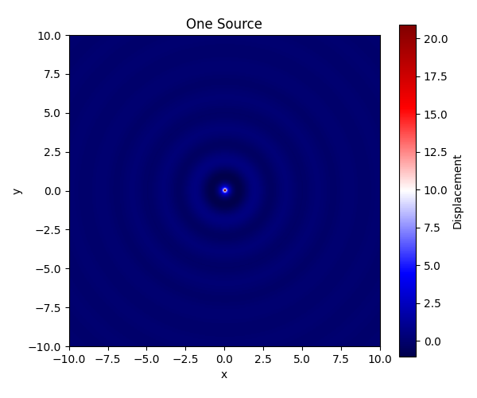
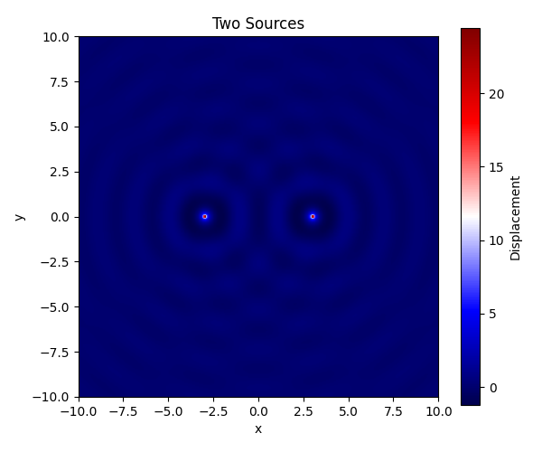
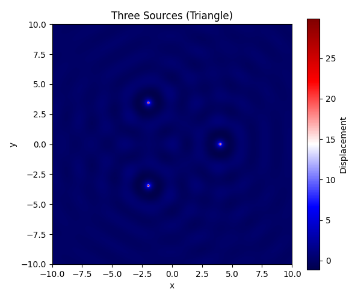
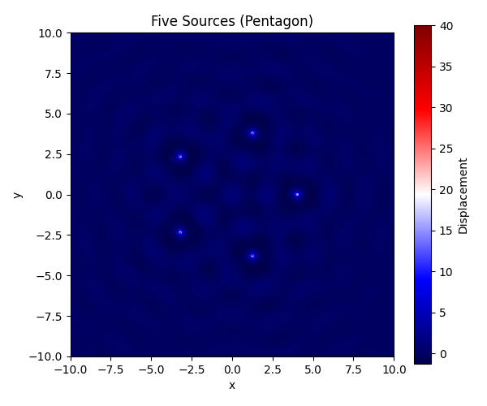
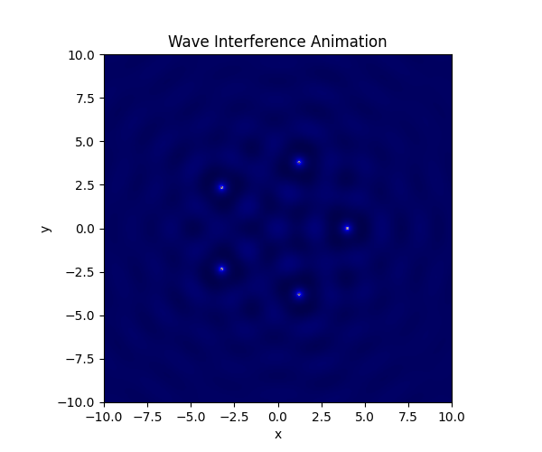

# Problem 1
# Interference Patterns on a Water Surface

## Motivation

Interference occurs when waves from different sources overlap, creating new patterns. On a water surface, this is easy to observe when ripples from different points meet. These patterns reveal how waves combine — either reinforcing each other (constructive interference) or canceling out (destructive interference).

Studying these patterns helps us understand wave behavior in a visual and intuitive way. This task allows us to explore the effects of wave phase, coherence, and geometry.

## Task Description

A circular wave emitted from a point source located at $(x_0, y_0)$ is modeled by the following equation:

$$
\eta(x, y, t) = \frac{A}{r} \cos(kr - \omega t + \phi)
$$

Where:
- $\eta(x, y, t)$: Water surface displacement at point $(x, y)$ and time $t$
- $A$: Wave amplitude
- $k = \frac{2\pi}{\lambda}$: Wave number (with $\lambda$ as wavelength)
- $\omega = 2\pi f$: Angular frequency (with $f$ as frequency)
- $r = \sqrt{(x - x_0)^2 + (y - y_0)^2}$: Distance from source
- $\phi$: Initial phase

When multiple sources emit waves, we use the principle of superposition:

$$
\eta_{\text{sum}}(x, y, t) = \sum_{i=1}^{N} \eta_i(x, y, t)
$$

## Python Simulation Code

To simulate and visualize the interference patterns for various point source configurations, use the following Python code.

```python
import numpy as np
import matplotlib.pyplot as plt
from matplotlib.animation import FuncAnimation
from mpl_toolkits.mplot3d import Axes3D  # Needed for 3D plot
import os

# --- Wave Parameters ---
A = 1  # Amplitude
wavelength = 2
frequency = 1
k = 2 * np.pi / wavelength
omega = 2 * np.pi * frequency
phi = 0  # Phase

# --- Coordinate Grid ---
x = np.linspace(-10, 10, 300)
y = np.linspace(-10, 10, 300)
X, Y = np.meshgrid(x, y)

# --- Polygon Vertex Generator ---
def polygon_vertices(n_sides, radius=4):
    return [(radius * np.cos(2 * np.pi * i / n_sides),
             radius * np.sin(2 * np.pi * i / n_sides)) for i in range(n_sides)]

# --- Wave from a Single Source ---
def wave_source(x0, y0, t):
    R = np.sqrt((X - x0)**2 + (Y - y0)**2)
    R[R == 0] = 1e-6  # avoid division by zero
    return (A / R) * np.cos(k * R - omega * t + phi)

# --- Superposition of Waves ---
def superpose_sources(positions, t=0):
    Z = np.zeros_like(X)
    for (x0, y0) in positions:
        Z += wave_source(x0, y0, t)
    return Z

# --- Plotting Helper ---
def plot_heatmap(Z, title, filename):
    plt.figure(figsize=(6, 5))
    plt.imshow(Z, extent=(-10, 10, -10, 10), cmap='seismic', origin='lower')
    plt.colorbar(label='Displacement')
    plt.title(title)
    plt.xlabel('x')
    plt.ylabel('y')
    plt.tight_layout()
    plt.savefig(filename)
    plt.show()

# --- Static Visualizations ---
plot_heatmap(superpose_sources([(0, 0)], t=0), "One Source", "one_source.png")
plot_heatmap(superpose_sources([(-3, 0), (3, 0)], t=0), "Two Sources", "two_sources.png")
plot_heatmap(superpose_sources(polygon_vertices(3)), "Three Sources (Triangle)", "triangle.png")
plot_heatmap(superpose_sources(polygon_vertices(5)), "Five Sources (Pentagon)", "pentagon.png")

# --- Optional: Animated GIF of Pentagon Interference ---
def generate_gif(positions, filename="interference_pentagon.gif", frames=60):
    fig, ax = plt.subplots(figsize=(6, 5))
    im = ax.imshow(superpose_sources(positions, t=0), extent=(-10,10,-10,10), cmap='seismic', origin='lower')
    ax.set_title("Wave Interference Animation")
    ax.set_xlabel('x')
    ax.set_ylabel('y')

    def update(frame):
        Z = superpose_sources(positions, t=frame * 0.2)
        im.set_array(Z)
        return [im]

    ani = FuncAnimation(fig, update, frames=frames, interval=80, blit=True)
    ani.save(filename, writer='pillow')
    plt.close()

generate_gif(polygon_vertices(5))  # Generates 'interference_pentagon.gif'

# --- Optional: 3D Surface Plot ---
def plot_3d(Z, title="3D Surface"):
    fig = plt.figure(figsize=(8, 6))
    ax = fig.add_subplot(111, projection='3d')
    ax.plot_surface(X, Y, Z, cmap='viridis', edgecolor='none')
    ax.set_title(title)
    ax.set_xlabel('x')
    ax.set_ylabel('y')
    ax.set_zlabel('Displacement')
    plt.tight_layout()
    plt.show()

plot_3d(superpose_sources(polygon_vertices(5), t=0), title="3D Interference (Pentagon)")
```

## Observations











- **One Source:** Symmetrical ripples, no interference  
- **Two Sources:** Alternating regions of constructive/destructive interference  
- **Triangle/Pentagon:** Clear geometric interference with repeating patterns  

## Deliverables 

- ✅ Static plots: `one_source.png`, `two_sources.png`, `triangle.png`, `pentagon.png`  
- ✅ Animation: `interference_pentagon.gif`  
- ✅ 3D Surface Visualization  
- ✅ Full Python simulation script embedded above  

---
