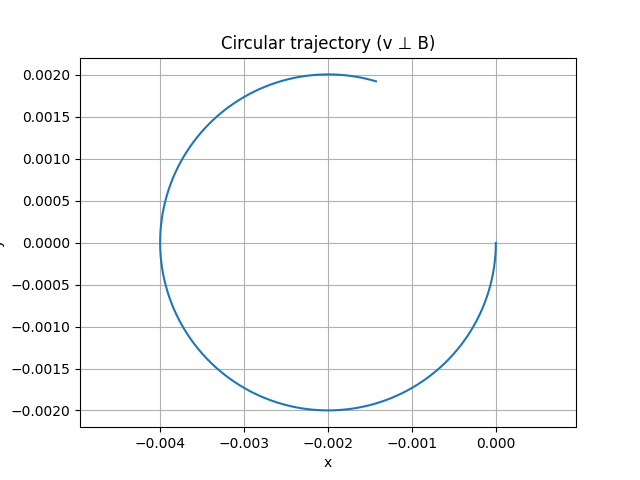
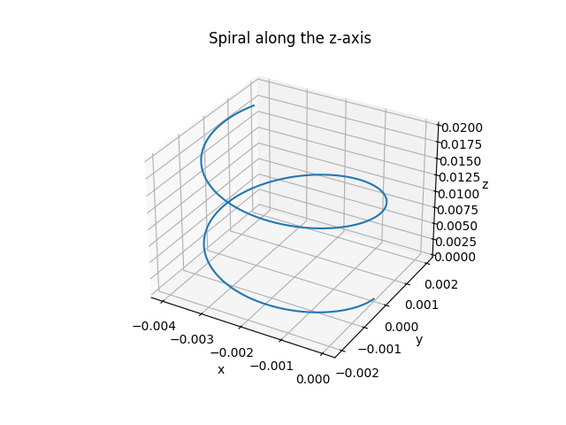
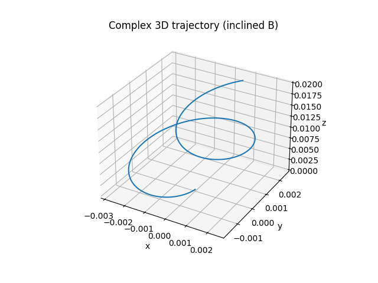

# Simulating the Effects of the Lorentz Force

## Motivation

The Lorentz force, expressed as:

$$
\vec{F} = q\vec{E} + q\vec{v} \times \vec{B}
$$

governs the motion of charged particles in electric and magnetic fields. This fundamental law is critical in applications ranging from plasma physics and particle accelerators to astrophysical phenomena. Through simulation, we can visualize and understand how particles move under the influence of these fields.

---

## 1. Exploration of Applications

- **Particle Accelerators**: Lorentz force is used to steer and accelerate particles.
- **Mass Spectrometers**: Charged particles are deflected by magnetic fields to determine mass-to-charge ratios.
- **Fusion Devices (e.g., Tokamaks)**: Magnetic confinement relies on controlled charged particle motion.

Electric ($\vec{E}$) and magnetic ($\vec{B}$) fields are essential tools for manipulating charged particles in controlled environments.

---

## 2. Simulation Assumptions

We use the following values for all simulations:

- Charge: $q = 1 \, \text{C}$
- Mass: $m = 1 \, \text{g} = 0.001 \, \text{kg}$
- Time step: $\Delta t = 0.01$ s
- Integration: Euler method

---

## 3. Simulating Trajectories Under Various Conditions

### A. Circular Motion in a Uniform Magnetic Field

No electric field. Particle moves perpendicular to $\vec{B}$.

$$
\vec{F} = q \vec{v} \times \vec{B}
$$

Expected result: circular path.

```python
import numpy as np
import matplotlib.pyplot as plt

# Constants
q = 1.0        # charge (C)
m = 0.001      # mass (kg)
B = np.array([0, 0, 1.0])  # magnetic field in z
E = np.array([0, 0, 0])    # no electric field

# Initial position and velocity (v ⊥ B)
r = np.array([0.0, 0.0, 0.0])
v = np.array([0.0, -2.0, 0.0])  # circle in x-y plane

dt = 1e-6
steps = 5000
r_list = []

for _ in range(steps):
    F = q * (E + np.cross(v, B))
    a = F / m
    v += a * dt
    r += v * dt
    r_list.append(r.copy())

r_list = np.array(r_list)
plt.plot(r_list[:, 0], r_list[:, 1])
plt.xlabel('x')
plt.ylabel('y')
plt.title('Circular trajectory (v ⊥ B)')
plt.axis('equal')
plt.grid(True)
plt.show()
```


---

### B. Spiral (Helical) Motion Along the Z-axis

Introduce a velocity component along the magnetic field direction ($z$):

$$
\vec{v}_0 = [1.0, 0.0, 1.0]
$$

This leads to **helical motion**.

```python
import numpy as np
import matplotlib.pyplot as plt
from mpl_toolkits.mplot3d import Axes3D

# Constants
q = 1.0
m = 0.001
B = np.array([0, 0, 1.0])  # magnetic field in z
E = np.array([0, 0, 0])

# Initial velocity has a z-component
r = np.array([0.0, 0.0, 0.0])
v = np.array([0.0, -2.0, 2.0])  # circular + linear z

dt = 1e-6
steps = 10000
r_list = []

for _ in range(steps):
    F = q * (E + np.cross(v, B))
    a = F / m
    v += a * dt
    r += v * dt
    r_list.append(r.copy())

r_list = np.array(r_list)
fig = plt.figure()
ax = fig.add_subplot(111, projection='3d')
ax.plot(r_list[:, 0], r_list[:, 1], r_list[:, 2])
ax.set_title('Spiral along the z-axis')
ax.set_xlabel('x')
ax.set_ylabel('y')
ax.set_zlabel('z')
plt.show()
```


---

### C. Complex Trajectory: Crossed Electric and Magnetic Fields

Using crossed $\vec{E}$ and $\vec{B}$ fields:

$$
\vec{E} = [1.0, 0.0, 0.0], \quad \vec{B} = [0.0, 0.0, 1.0]
$$

This results in **drift motion** in a direction perpendicular to both fields.

```python
import numpy as np
import matplotlib.pyplot as plt
from mpl_toolkits.mplot3d import Axes3D

# Constants
q = 1.0
m = 0.001
B = np.array([0.2, 0, 1.0])  # inclined magnetic field
E = np.array([0, 0, 0])

r = np.array([0.0, 0.0, 0.0])
v = np.array([0.0, -2.0, 2.0])  # initial velocity

dt = 1e-6
steps = 10000
r_list = []

for _ in range(steps):
    F = q * (E + np.cross(v, B))
    a = F / m
    v += a * dt
    r += v * dt
    r_list.append(r.copy())

r_list = np.array(r_list)
fig = plt.figure()
ax = fig.add_subplot(111, projection='3d')
ax.plot(r_list[:, 0], r_list[:, 1], r_list[:, 2])
ax.set_title('Complex 3D trajectory (inclined B)')
ax.set_xlabel('x')
ax.set_ylabel('y')
ax.set_zlabel('z')
plt.show()
```


---

## 4. Parameter Exploration

We explore how changes in the following affect particle trajectories:

- Electric and magnetic field strengths ($|\vec{E}|, |\vec{B}|$)
- Initial velocity $\vec{v}_0$
- Charge $q$ and mass $m$

Key physical quantities:

### Larmor Radius:

$$
r_L = \frac{m v_\perp}{|q B|}
$$

### Cyclotron Frequency:

$$
\omega_c = \frac{|q B|}{m}
$$

### Drift Velocity in Crossed Fields:

$$
\vec{v}_d = \frac{\vec{E} \times \vec{B}}{B^2}
$$

These determine whether the particle undergoes tight circular motion, slow spirals, or fast linear drifts.

---

## 5. Visualization Summary

### Scenarios Visualized:

- **Circular motion** in 2D under uniform $\vec{B}$
- **Spiral (helical)** motion along $z$-axis with initial velocity component in $\vec{B}$ direction
- **Drift motion** under crossed $\vec{E}$ and $\vec{B}$

Each plot demonstrates how the Lorentz force shapes the trajectory based on the field configuration.

---

## 6. Discussion and Real-World Relevance

These simulations relate to practical technologies:

- **Cyclotrons**: Acceleration through circular paths
- **Magnetic Traps**: Confinement using Lorentz force balancing
- **Fusion Reactors**: Plasma control via $\vec{E}$ and $\vec{B}$ shaping
- **Mass Spectrometry**: Field-dependent ion separation

Understanding and simulating the Lorentz force enhances both theoretical insight and engineering capability.

---

