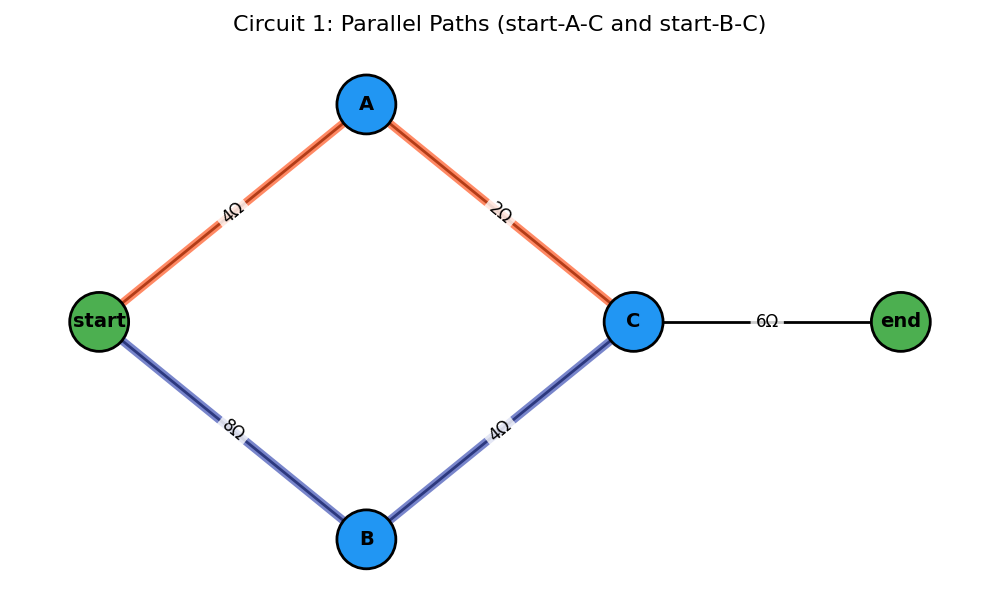
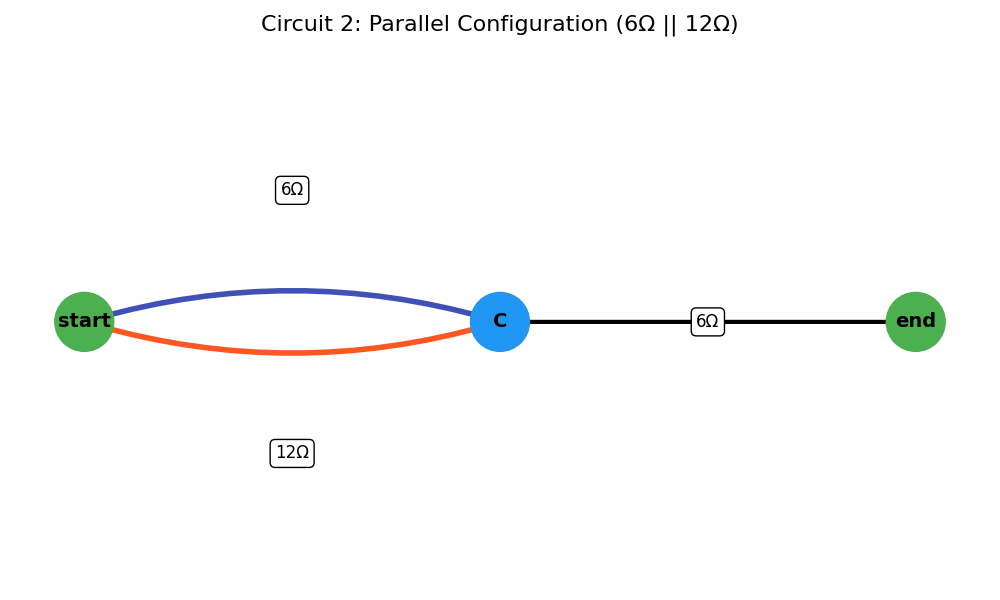
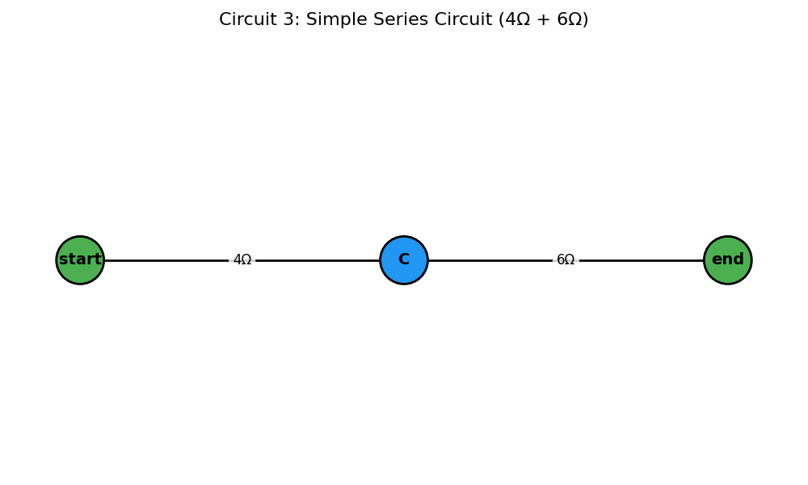
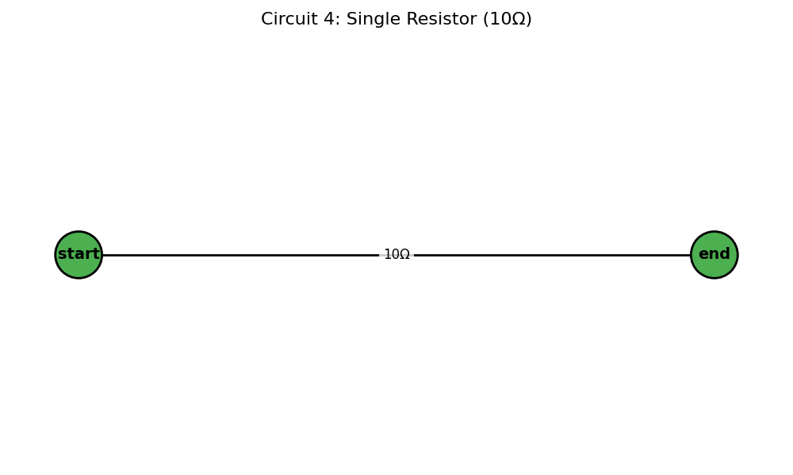

# Problem 1
# Equivalent Resistance Using Graph Theory

## Introduction and Motivation

Calculating equivalent resistance is a fundamental task in circuit analysis. While traditional approaches use series and parallel simplification rules manually, graph theory provides a powerful alternative — transforming circuit analysis into an algorithmic graph simplification process.

Circuits can be represented as **graphs**:
- **Nodes** = junctions
- **Edges** = resistors (with resistance as weight)

By identifying **series** and **parallel** patterns in the graph, we can iteratively reduce it to compute total resistance between two terminals.

This approach is:
- **Scalable** for large networks
- **Automatable** for software
- **Insightful** for understanding electrical connectivity and topology

---

## Learning Goals

After completing this task, you should be able to:

- Represent a resistor network as a weighted graph.
- Apply reduction rules (series and parallel) using graph algorithms.
- Implement an algorithm that simplifies arbitrary configurations.
- Analyze different circuit structures programmatically.

---

### 1. Algorithm 

The circuit is modeled as a multigraph $G=(V, E)$, where $V$ is the set of junctions (nodes) and $E$ is the set of resistors (edges). Each edge $e \in E$ has a weight $r_e$ representing its resistance. Two distinct nodes, `start_node` and `end_node`, are specified as the terminals across which the equivalent resistance is sought.

The algorithm proceeds as follows:

1.  **Initialization**:
    * Construct the graph from the given circuit components.
    * Validate that `start_node` and `end_node` exist in the graph. If `start_node` == `end_node`, the resistance is $0 \Omega$.

2.  **Iterative Reduction**: Repeatedly apply the following reduction rules until no more simple series or parallel reductions are possible, or the graph is reduced to a single edge between `start_node` and `end_node`.

    * **Parallel Reduction**:
        * **Identification**: Find any pair of nodes $(u, v)$ connected by two or more edges (resistors $R_1, R_2, \dots, R_k$).
        * **Reduction**: Replace these $k$ parallel resistors with a single equivalent resistor $R_p$ between $u$ and $v$. The equivalent resistance is calculated as:
            $$R_p = \left( \sum_{i=1}^{k} \frac{1}{R_i} \right)^{-1}$$
            If any $R_i = 0$, $R_p = 0$. If all $R_i = \infty$, $R_p = \infty$.
        * **Action**: Remove the original $k$ edges and add a new edge $(u,v)$ with resistance $R_p$. If $R_p = \infty$, effectively remove the connection unless it's the only path.
        * After a reduction, restart the scan for further simplifications as the graph structure has changed.

    * **Series Reduction**:
        * **Identification**: Find any node $w$ such that:
            1.  $w$ is not the `start_node` or `end_node`.
            2.  The degree of $w$, $\text{deg}(w)$, is exactly 2. Let the two edges incident to $w$ be $(u,w)$ with resistance $R_1$ and $(w,v)$ with resistance $R_2$.
            3.  Ensure $u \neq v$. (If $u=v$, it's a loop, not a simple series element in a path from `start_node` to `end_node`).
        * **Reduction**: Replace the two series resistors $R_1$ and $R_2$ and the intermediate node $w$ with a single equivalent resistor $R_s$ between $u$ and $v$. The equivalent resistance is:
            $$R_s = R_1 + R_2$$
            If $R_1 = \infty$ or $R_2 = \infty$, then $R_s = \infty$.
        * **Action**: Remove node $w$ (which also removes edges $(u,w)$ and $(w,v)$). Add a new edge $(u,v)$ with resistance $R_s$. If $R_s = \infty$, effectively this path segment becomes an open circuit.
        * After a reduction, restart the scan.

3.  **Termination and Result**:
    * The loop terminates if no series or parallel reductions were made in a full pass.
    * **Ideal Case**: If the graph is reduced to a single edge between `start_node` and `end_node`, its resistance is the equivalent resistance.
    * **Final Parallel Case**: If the graph consists of only `start_node` and `end_node` and multiple edges directly connecting them, these are in parallel. Calculate their combined parallel resistance.
    * **Non-Reducible Case**: If the graph cannot be simplified further by these rules to one of the above states, the circuit may contain non-series-parallel configurations (e.g., a Wheatstone bridge not in balance). The algorithm, in this form, will report that it cannot fully reduce the circuit.
    * **Open Circuit**: If, at any point or at the end, there is no path between `start_node` and `end_node`, the equivalent resistance is $\infty$.
    * **Short Circuit**: If an equivalent resistance of $0 \Omega$ is found.


### Series Connection

Two resistors `R₁` and `R₂` in series:

$$ R_{eq} = R_1 + R_2 $$

### Parallel Connection

Two resistors `R₁` and `R₂` in parallel:

$$
\frac{1}{R_{eq}} = \frac{1}{R_1} + \frac{1}{R_2}
\quad \Rightarrow \quad
R_{eq} = \left( \frac{1}{R_1} + \frac{1}{R_2} \right)^{-1}
$$

---

## Implementation in Python with `networkx`

Below is a complete Python implementation and visualization of step-by-step circuit simplification using `networkx`.

## code 
```python
import matplotlib.pyplot as plt
import networkx as nx

class ResistorNetworkAnalyzer:
    def __init__(self):
        self.step_count = 0
        self.visualization_steps = []
        
    def draw_circuit(self, G, pos, title, highlight_edges=None):
        """Improved visualization function with better highlighting"""
        plt.figure(figsize=(10, 6))
        
        # Node styling
        special_nodes = ['B+', 'B-', 'start', 'end']
        node_colors = ['#4CAF50' if node in special_nodes else '#2196F3' for node in G.nodes()]
        nx.draw_networkx_nodes(G, pos, node_color=node_colors, node_size=1800, 
                             edgecolors='black', linewidths=2)
        nx.draw_networkx_labels(G, pos, font_size=14, font_weight='bold')
        
        # Draw all edges
        nx.draw_networkx_edges(G, pos, width=2, edge_color='black')
        
        # Highlight edges that were modified
        if highlight_edges:
            nx.draw_networkx_edges(G, pos, edgelist=highlight_edges,
                                 edge_color='#FF5722', width=6, alpha=0.7)
        
        # Edge labels with resistance values
        edge_labels = {}
        for u, v, data in G.edges(data=True):
            if 'resistance' in data:
                edge_labels[(u, v)] = f"{data['resistance']:.2f}Ω"
            elif isinstance(G, nx.MultiGraph) and G.number_of_edges(u, v) > 0:
                # Handle multigraph case
                edge_data = G.get_edge_data(u, v)
                if edge_data:
                    first_key = next(iter(edge_data))
                    edge_labels[(u, v)] = f"{edge_data[first_key]['resistance']:.2f}Ω"
        
        nx.draw_networkx_edge_labels(G, pos, edge_labels=edge_labels, font_size=12,
                                   bbox=dict(facecolor='white', edgecolor='none',
                                            alpha=0.8, boxstyle='round,pad=0.3'))
        
        plt.title(title, fontsize=16, pad=20)
        plt.axis('off')
        plt.tight_layout()
        plt.show()

    def combine_series(self, G, pos):
        """Combine series resistors with visualization"""
        changed = True
        while changed:
            changed = False
            for node in list(G.nodes):
                if G.degree(node) == 2 and node not in ("B+", "B-", "start", "end"):
                    neighbors = list(G.neighbors(node))
                    if len(neighbors) == 2:
                        u, v = neighbors
                        
                        # Get resistances
                        r1 = G[node][u]['resistance']
                        r2 = G[node][v]['resistance']
                        combined = r1 + r2
                        
                        # Store edges being combined for visualization
                        edges_combined = [(node, u), (node, v)]
                        
                        # Modify the graph
                        G.remove_node(node)
                        G.add_edge(u, v, resistance=combined)
                        changed = True
                        self.step_count += 1
                        
                        # Visualize this step
                        title = f"Step {self.step_count}: Series {u}-{node}-{v} → {combined:.2f}Ω"
                        self.draw_circuit(G, pos, title, edges_combined)
                        self.visualization_steps.append((G.copy(), title, edges_combined))
                        break  # Restart iteration after modification

    def combine_parallel(self, G, pos):
        """Combine parallel resistors with visualization"""
        changed = True
        while changed:
            changed = False
            parallel_pairs = self._find_parallel_pairs(G)
            
            for u, v in parallel_pairs:
                edges_data = self._get_parallel_edges_data(G, u, v)
                if len(edges_data) > 1:
                    combined = 1 / sum(1/e['resistance'] for e in edges_data)
                    
                    # Store edges being combined for visualization
                    edges_combined = [(u, v)] * len(edges_data)
                    
                    # Modify the graph
                    G.remove_edges_between(u, v)
                    G.add_edge(u, v, resistance=combined)
                    changed = True
                    self.step_count += 1
                    
                    # Visualize this step
                    title = f"Step {self.step_count}: Parallel {u}-{v} → {combined:.2f}Ω"
                    self.draw_circuit(G, pos, title, edges_combined)
                    self.visualization_steps.append((G.copy(), title, edges_combined))
                    break  # Restart iteration after modification

    def _find_parallel_pairs(self, G):
        """Find all pairs of nodes with parallel edges"""
        pairs = set()
        if isinstance(G, nx.MultiGraph):
            for u, v, key in G.edges(keys=True):
                if (u, v) not in pairs and (v, u) not in pairs:
                    if G.number_of_edges(u, v) > 1:
                        pairs.add((u, v))
        else:
            # For simple graphs, look for multiple edges between same nodes
            edges = list(G.edges())
            for i, (u1, v1) in enumerate(edges):
                for (u2, v2) in edges[i+1:]:
                    if (u1 == u2 and v1 == v2) or (u1 == v2 and v1 == u2):
                        pairs.add((u1, v1))
        return list(pairs)

    def _get_parallel_edges_data(self, G, u, v):
        """Get data for all parallel edges between two nodes"""
        if isinstance(G, nx.MultiGraph):
            return [G[u][v][key] for key in G[u][v]]
        else:
            return [G.get_edge_data(u, v)] if G.has_edge(u, v) else []

    def simplify_network(self, G, pos, source, sink):
        """Main function to simplify the resistor network"""
        self.step_count = 0
        self.visualization_steps = []
        
        # Initial visualization
        self.draw_circuit(G, pos, "Original Circuit")
        
        # Make a copy to work with
        working_graph = G.copy()
        
        # Alternate between series and parallel combinations
        prev_edges = len(working_graph.edges())
        while True:
            self.combine_series(working_graph, pos)
            self.combine_parallel(working_graph, pos)
            
            # Check if we're stuck
            current_edges = len(working_graph.edges())
            if current_edges == prev_edges:
                break
            prev_edges = current_edges
        
        # Final result
        if working_graph.has_edge(source, sink):
            final_resistance = working_graph[source][sink]['resistance']
            print(f"Final equivalent resistance: {final_resistance:.2f}Ω")
        else:
            print("Could not reduce to a single equivalent resistance")
        
        return working_graph, final_resistance


# ======= Example Circuits =======

# Circuit 1: Series-Parallel Combination
G1 = nx.Graph()
G1.add_edge('start', 'A', resistance=4)
G1.add_edge('A', 'C', resistance=2)
G1.add_edge('start', 'B', resistance=8)
G1.add_edge('B', 'C', resistance=4)
G1.add_edge('C', 'end', resistance=6)

pos1 = {
    'start': (0, 0),
    'A': (1, 1),
    'B': (1, -1),
    'C': (2, 0),
    'end': (3, 0)
}

# Circuit 2: Parallel Configuration
G2 = nx.MultiGraph()
G2.add_edge('start', 'C', resistance=6)
G2.add_edge('start', 'C', resistance=12)
G2.add_edge('C', 'end', resistance=6)

pos2 = {
    'start': (0, 0),
    'C': (3, 0),
    'end': (6, 0)
}

# Create analyzer instance
analyzer = ResistorNetworkAnalyzer()

# Analyze first circuit
print("\nAnalyzing Circuit 1")
simplified_G1, R_eq1 = analyzer.simplify_network(G1, pos1, 'start', 'end')

# Analyze second circuit
print("\nAnalyzing Circuit 2")
simplified_G2, R_eq2 = analyzer.simplify_network(G2, pos2, 'start', 'end')
```









---

## Summary

Graph theory allows us to **automatically simplify resistor networks**, handle **complex configurations**, and is highly suited for **software tools** and **educational simulations**.

---

## Resources

- [`networkx` documentation](https://networkx.org/)
- Circuit visualization tools
- Graph reduction algorithms
