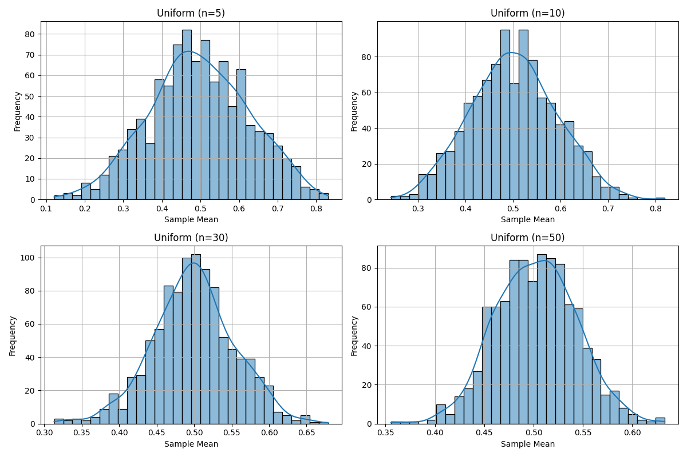
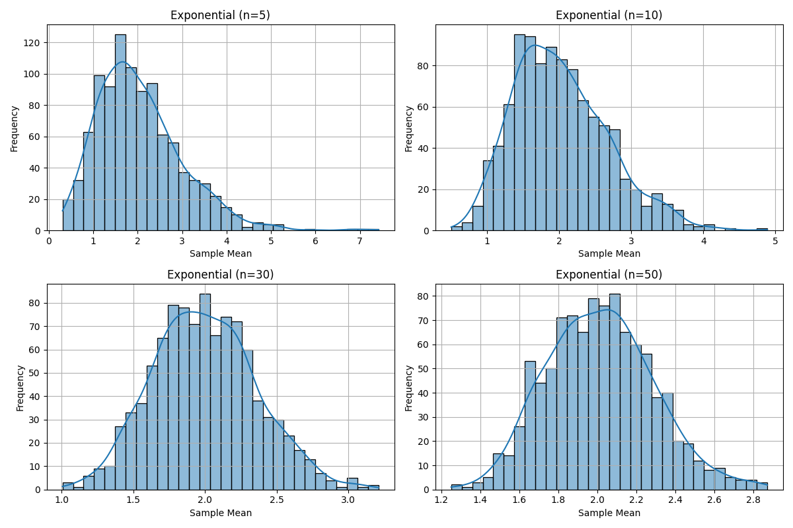
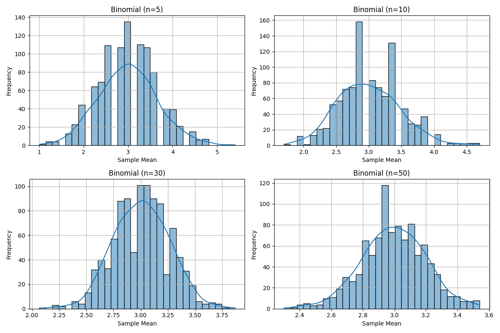

# Problem 1
# 📊 Exploring the Central Limit Theorem Through Simulations

## 📌 Motivation

The **Central Limit Theorem (CLT)** is a cornerstone of statistics. It states that the sampling distribution of the sample mean becomes approximately normal as the sample size increases — regardless of the population’s original distribution. Simulations help visualize and understand this concept in an intuitive way.

---

## 🎯 Problem Overview

### Objective

Use Python simulations to explore how sample means from various population distributions approach a normal distribution as sample size increases.

---

## 🧪 Tasks

### 1. Simulating Sampling Distributions

Select different population distributions to simulate:

- Uniform distribution
- Exponential distribution
- Binomial distribution

For each, generate a large dataset representing the population (e.g., 100,000 values).

---

### 2. Sampling and Visualization

- Randomly draw samples of varying sizes (e.g., `n = 5, 10, 30, 50`) from the population.
- Calculate the **sample mean** for each draw.
- Repeat the process (e.g., 1,000 times) to build a **sampling distribution**.
- Plot histograms of these sample means and observe their shapes.

---

### 3. Parameter Exploration

Explore the following:

- How the **original distribution’s shape** affects the rate of convergence to normality.
- How **sample size** influences convergence.
- The effect of **population variance** on the spread of the sampling distribution.

---

### 4. Real-World Applications

Understand the significance of CLT in practical scenarios:

- Estimating population parameters from samples
- Quality control and process monitoring
- Financial modeling and risk assessment
## 🧪 Simulation Details

We simulate data from the following population distributions:

- Uniform distribution
- Exponential distribution
- Binomial distribution

For each distribution:

- A population of 100,000 values is generated
- Samples of sizes `n = 5, 10, 30, 50` are drawn repeatedly (1,000 times)
- Sample means are calculated and plotted as histograms

---

## 💻 Python Code

```python
import numpy as np
import matplotlib.pyplot as plt
import seaborn as sns

def generate_population(dist, size=100_000, **kwargs):
    if dist == 'uniform':
        return np.random.uniform(kwargs.get('low', 0), kwargs.get('high', 1), size)
    if dist == 'exponential':
        return np.random.exponential(kwargs.get('scale', 1.0), size)
    if dist == 'binomial':
        return np.random.binomial(kwargs.get('n', 10), kwargs.get('p', 0.5), size)
    raise ValueError(f"Unknown distribution: {dist}")

def sample_means(pop, sample_size, n_samples=1000):
    return [np.mean(np.random.choice(pop, sample_size, replace=False)) for _ in range(n_samples)]

def plot_sampling_dists(populations, sample_sizes, n_samples=1000, bins=30):
    for name, pop in populations.items():
        plt.figure(figsize=(12, 8))
        for i, n in enumerate(sample_sizes, 1):
            means = sample_means(pop, n, n_samples)
            plt.subplot(2, 2, i)
            sns.histplot(means, kde=True, bins=bins)
            plt.title(f"{name.title()} (n={n})")
            plt.xlabel("Sample Mean")
            plt.ylabel("Frequency")
            plt.grid(True)
        plt.tight_layout()
        plt.show()

if __name__ == "__main__":
    dists = {
        'uniform':    {'low': 0, 'high': 1},
        'exponential':{'scale': 2.0},
        'binomial':   {'n': 10, 'p': 0.3},
    }
    pops = {name: generate_population(name, **params) for name, params in dists.items()}
    sizes = [5, 10, 30, 50]
    plot_sampling_dists(pops, sizes)
```

---


## 📌 Output

The script generates a set of plots for each distribution. Each plot shows how the distribution of sample means changes as the sample size increases — illustrating the Central Limit Theorem in action.

---







