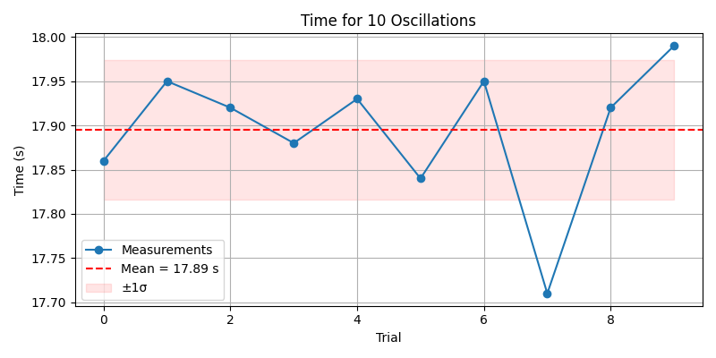
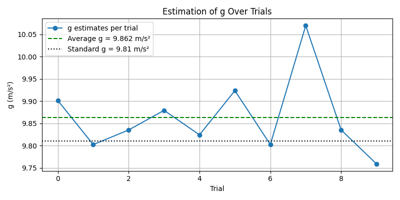
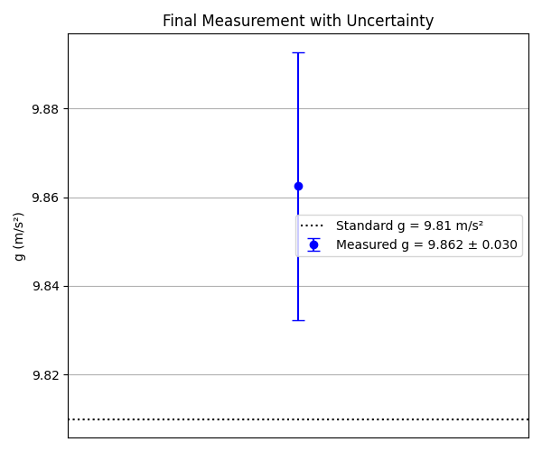

# Problem 1  
# 🌍 Measuring Earth's Gravitational Acceleration with a Pendulum

## 📌 Motivation

The acceleration due to gravity, **g**, is a fundamental constant in physics. Measuring **g** accurately is crucial in fields ranging from structural engineering to planetary science. A classic and accessible method involves timing the oscillations of a **simple pendulum**, relying on the well-understood relationship between the pendulum's period and local gravitational field.

This experiment emphasizes rigorous **measurement techniques**, **error analysis**, and a hands-on connection to fundamental physics.

---

## 🧪 Objective

Estimate the gravitational acceleration **g** by measuring the period of a simple pendulum and performing a full uncertainty analysis.

---

## Background Theory

The motion of a simple pendulum (for small angles $\theta < 15^\circ$) is described by the equation:

$T = 2\pi \sqrt{\frac{L}{g}}$

Where:  
- $T$ is the period of one oscillation (in seconds)  
- $L$ is the length of the pendulum (in meters)  
- $g$ is the acceleration due to gravity (in m/s²)  

Rearranged to solve for $g$:

$g = \frac{4\pi^2 L}{T^2}$

---

## 🧰 Materials

- String: 0.8 meters long  
- Mass: e.g., bag of coins, metal washer, small weight  
- Ruler or measuring tape 
- Stopwatch or smartphone timer  
- Fixed support (e.g., hook, rod, table edge)

---

## 🛠️ Procedure

### 1. Setup

- Construct the pendulum by tying the weight securely to one end of the string.
- Fix the other end to a support so that the pendulum can swing freely.
- **Measure the length** of the pendulum from the point of suspension to the center of mass of the weight.

> **Notation:**  


> Let $L$ be the length of the pendulum (in meters) in our case it is 0.8m

> Ruler measure resolution = 1 mm 

> Although the ruler resolution is 1 mm, due to observation limits, we consider an effective resolution of 2 mm. Therefore,

> Let $ΔL = (\text{resolution of measuring tool}) / 2 = 0.001$ m

### 2. Data Collection

- Displace the pendulum by less than **15°** and release it.
- Use a stopwatch to **time 10 full oscillations**.
- Repeat this process **10 times** to reduce random error.

---

## 📊 Sample Data Table

| Trial | Time for 10 Oscillations (T₁₀) [s] |
|-------|------------------------------------|
| 1     | 17.86                              |
| 2     | 17.95                              |
| 3     | 17.92                              |
| 4     | 17.88                              |
| 5     | 17.93                              |
| 6     | 17.84                              |
| 7     | 17.95                              |
| 8     | 17.71                              |
| 9     | 17.92                              |
| 10    | 17.99                              |

---

## 📐 Calculations

### ✅ Mean time for 10 oscillations:

$\overline{T_{10}} = 17.895$ s

### ✅ Standard deviation:

$\sigma_T = 0.078$ s

### ✅ Uncertainty in $\overline{T_{10}}$:

$\Delta T_{10} = \frac{\sigma_T}{\sqrt{10}} = 0.025$ s

### ✅ Period of one oscillation:

$T = \frac{17.895}{10} = 1.7895$ s

### ✅ Uncertainty in $T$:

$\Delta T = \frac{0.025}{10} = 0.0025$ s

### ✅ Calculated gravitational acceleration:

$g = \frac{4\pi^2 \cdot 0.800}{(1.7895)^2} = 9.862$ m/s²

---

## 📉 Uncertainty in $g$

Relative uncertainty:

$\frac{\Delta g}{g} = \sqrt{\left(\frac{\Delta L}{L}\right)^2 + \left(2 \cdot \frac{\Delta T}{T}\right)^2} = \sqrt{(0.00125)^2 + (0.0028)^2} = 0.0031$

Absolute uncertainty:

$\Delta g = 0.0031 \cdot 9.862 = 0.030$ m/s²

---

## ✅ Final Result

$g = 9.862 \pm 0.030 \ \text{m/s}^2$

---


---

## 📈 Analysis

### ✅ Comparison

- **Standard gravitational acceleration:** `9.81 m/s²`
- **Measured value:** `9.862 ± 0.030 m/s²`

### 🧾 Discussion

- **Uncertainty in Length (ΔL):**
  - Originates from ruler resolution; using a better tool would improve accuracy.
  
- **Uncertainty in Timing (ΔT):**
  - Human reaction time introduces variability. Using automated timing improves reliability.
  - Repeating measurements 10 times helps reduce random error in `T`.

- **Assumptions:**
  - Small-angle approximation (<15°)
  - Air resistance and friction at pivot are negligible
  - Rigid, massless string

---

```python
import numpy as np
import matplotlib.pyplot as plt

# Updated pendulum data (corrected 8th value from 17.99 to 17.71)
T10_measurements = np.array([17.86, 17.95, 17.92, 17.88, 17.93, 17.84, 17.95, 17.71, 17.92, 17.99])
L = 0.800
delta_L = 0.001  # 2mm resolution → ΔL = 0.001 m

# Mean and standard deviation
T10_mean = np.mean(T10_measurements)
T10_std = np.std(T10_measurements, ddof=1)
delta_T10 = T10_std / np.sqrt(len(T10_measurements))

# Period and uncertainty
T = T10_mean / 10
delta_T = delta_T10 / 10

# Gravitational acceleration
g = (4 * np.pi**2 * L) / T**2

# Uncertainty in g
rel_uncertainty = np.sqrt((delta_L / L)**2 + (2 * delta_T / T)**2)
delta_g = g * rel_uncertainty

# Print results
print(f"Mean time for 10 oscillations (T10): {T10_mean:.3f} ± {delta_T10:.3f} s")
print(f"Period (T): {T:.4f} ± {delta_T:.4f} s")
print(f"Calculated g: {g:.3f} ± {delta_g:.3f} m/s²")

# Plot 1: T10 measurements
plt.figure(figsize=(8, 4))
plt.plot(T10_measurements, 'o-', label='Measurements')
plt.axhline(y=T10_mean, color='red', linestyle='--', label=f'Mean = {T10_mean:.2f} s')
plt.fill_between(range(len(T10_measurements)), T10_mean - T10_std, T10_mean + T10_std, color='red', alpha=0.1, label='±1σ')
plt.title("Time for 10 Oscillations")
plt.xlabel("Trial")
plt.ylabel("Time (s)")
plt.legend()
plt.grid(True)
plt.tight_layout()
plt.show()

# Plot 2: Convergence of g estimation
g_estimates = (4 * np.pi**2 * L) / (T10_measurements / 10)**2
plt.figure(figsize=(8, 4))
plt.plot(g_estimates, 'o-', label='g estimates per trial')
plt.axhline(y=g, color='green', linestyle='--', label=f'Average g = {g:.3f} m/s²')
plt.axhline(y=9.81, color='black', linestyle=':', label='Standard g = 9.81 m/s²')
plt.title("Estimation of g Over Trials")
plt.xlabel("Trial")
plt.ylabel("g (m/s²)")
plt.legend()
plt.grid(True)
plt.tight_layout()
plt.show()

# Plot 3: Final g estimate with uncertainty
plt.figure(figsize=(6, 5))
plt.errorbar(1, g, yerr=delta_g, fmt='o', color='blue', capsize=5, label=f'Measured g = {g:.3f} ± {delta_g:.3f}')
plt.axhline(y=9.81, color='black', linestyle=':', label='Standard g = 9.81 m/s²')
plt.xlim(0, 2)
plt.xticks([])
plt.ylabel("g (m/s²)")
plt.title("Final Measurement with Uncertainty")
plt.legend()
plt.grid(True)
plt.tight_layout()
plt.show()

```






---

---

## 📝 Conclusion

This experiment provides a clear, practical method to determine gravitational acceleration using a pendulum. Repeating measurements and analyzing uncertainty with statistical tools improves reliability and strengthens understanding of physical principles and error propagation.

---

## 🧾 Comparison

- **Standard gravitational acceleration:** `9.81 m/s²`  
- **Measured value:** `9.862 ± 0.030 m/s²`  
- ✅ The result is consistent with the accepted value within the margin of uncertainty.

